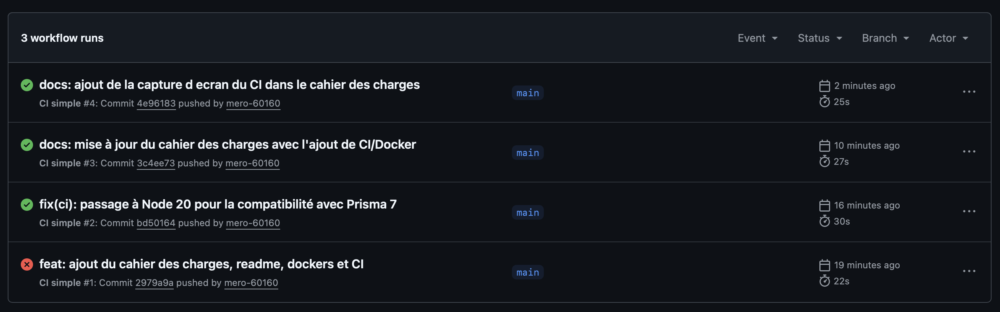

# Cahier des Charges - Mini CRM (Projet CDA)

## 1. Présentation du projet
Pour valider mon titre de Concepteur Développeur d'Applications (CDA), j'ai travaillé sur le développement d'une application de type "Mini CRM". L'idée c'est d'avoir une solution simple pour gérer un portefeuille de clients et faire de la facturation rapidement avec des devis.
Ce document fait un récapitulatif de l'état d'avancement du projet, des choix techniques et des fonctionnalités que j'ai déjà implémentées.

**Dépôt du code source** : Le projet est versionné sur GitHub, disponible ici : [https://github.com/mero-60160/mon-projet-cda](https://github.com/mero-60160/mon-projet-cda)
**Gestion de projet (Kanban)** : Pour m'organiser, j'ai découpé mes tâches sur un tableau Trello disponible ici : [https://trello.com/invite/b/69c544a6138f9d79f242cdc7/ATTI1b58529893aa5e4a534ccfd13cb5f8a35F2C1BDC/projetcda](https://trello.com/invite/b/69c544a6138f9d79f242cdc7/ATTI1b58529893aa5e4a534ccfd13cb5f8a35F2C1BDC/projetcda)

## 2. Fonctionnalités implémentées

L'application couvre actuellement les besoins suivants :

### A. Authentification et Sécurité
Toute la partie création de compte et connexion est 100% fonctionnelle.
- Je hache les mots de passe en base de données avec la librairie `bcryptjs` pour plus de sécurité.
- Pour maintenir la session, je suis parti sur des tokens JWT.

Voilà comment la création du token se passe lors de la connexion côté backend (extrait de `authentification.controleur.js`) :
```javascript
// Génération du token JWT (valide 24h)
const token = jwt.sign(
  { id: utilisateur.id },
  process.env.JWT_SECRET,
  { expiresIn: '24h' }
);
res.json({ message: "Connexion réussie.", token, nom: utilisateur.nom, prenom: utilisateur.prenom });
```

Côté frontend, je récupère le token de l'API et je le stocke dans le navigateur, comme ça l'utilisateur reste bien connecté au Dashboard :
```javascript
localStorage.setItem('crm_token', reponse.data.token);
localStorage.setItem('crm_user', JSON.stringify({ nom: reponse.data.nom, prenom: reponse.data.prenom }));
```

### B. Gestion des clients
Quand un utilisateur se connecte, il peut gérer son carnet d'adresses complet (Création, Lecture, Modification). Voilà d'ailleurs comment j'ai construit l'entité `Client` dans Prisma :
```prisma
model Client {
  id        Int      @id @default(autoincrement())
  nom       String
  prenom    String
  email     String?
  telephone String?
  entreprise String?
  adresse   String?
  createdAt DateTime @default(now())
  
  userId    Int
  user      User  @relation(fields: [userId], references: [id])
}
```
Avec la clé étrangère `userId`, je garantis que chaque compte voit seulement ses propres clients.

### C. Gestion des Devis
Le backend gère aussi l'ajout de devis qui sont directement rattachés aux clients. Un devis peut avoir plusieurs statuts différents (brouillon, envoyé, refusé) et il est toujours composé de sous-lignes (`LigneDevis`) pour recalculer précisément le HT et le TTC final. 

## 3. Choix techniques et Justifications

- **Frontend (React.js / Vite)** : L'interface utilisateur est réalisée en React.js. C'est un choix fort pour ce projet puisque je n'avais encore jamais utilisé React auparavant. Cela m'a permis d'apprendre toute la logique des composants réutilisables et la gestion des états (via `useState`). Le projet a été initialisé avec Vite pour sa rapidité d'exécution. Les requêtes HTTP se font avec `axios` et l'esthétique reste en CSS classique pour maitriser l'affichage.

- **Backend (Node.js / Express.js)** : J'ai codé une API REST en Node.js avec Express.js. J'ai fait ce choix pour garder un environnement 100% JavaScript (Fullstack JS). L'architecture est découpée de façon assez classique (ex: un dossier pour les contrôleurs : `clients.controleur.js`, `devis.controleur.js`, etc.) pour s'y retrouver facilement.

- **Base de données et ORM (PostgreSQL / Prisma)** : PostgreSQL a été choisie comme base de données. Pour la relier au backend, j'ai décidé de faire un essai avec l'ORM Prisma, un outil que je n'avais jamais manipulé non plus. Je l'ai trouvé très pratique car il permet de déclarer mes entités de façon claire avec ses schémas, de gérer les migrations de la base de données sans prise de tête, et ça m'évite de faire des requêtes SQL à la main.

- **Déploiement et CI (Docker / GitHub Actions)** : Pour m'entraîner au DevOps, j'ai aussi rajouté des fichiers Docker pour mon front et mon back. Avec un `docker-compose`, je peux lancer tout l'environnement en local sans galérer sur les conflits de versions. J'ai aussi fait un petit workflow sur GitHub (pipeline CI) hyper basique : à chaque push, un robot teste l'application avec un `npm install` pour vérifier que je n'ai rien cassé au moment d'enregistrer mon travail.



## 4. Evolutions prévues
Maintenant que toute la base technologique est là, mes priorités sont :
- Permettre la création d'un vrai fichier PDF d'export pour un devis.
- Rajouter 2 ou 3 petits tests automatisés sur les routes du back qui gèrent l'authentification.
