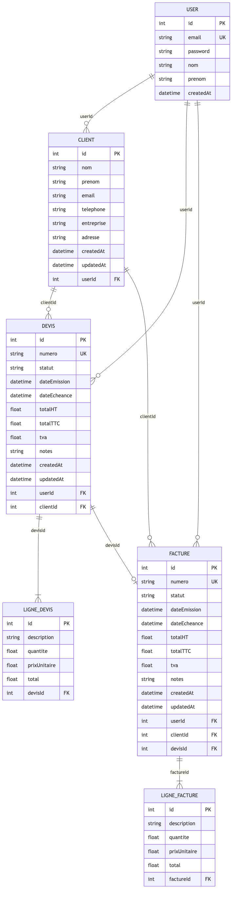
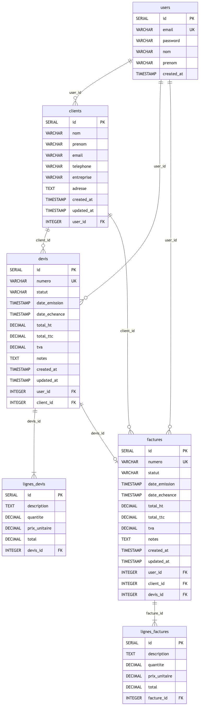

---
pdf_options:
  format: A4
  margin:
    top: 20mm
    bottom: 20mm
    left: 15mm
    right: 15mm
  printBackground: true
  displayHeaderFooter: true
  headerTemplate: "<div></div>"
  footerTemplate: "<div style='font-size: 10pt; width: 100%; text-align: center; font-family: sans-serif; color: #555;'><span class='pageNumber'></span></div>"
stylesheet: docs_livrables/dossier_style.css
---

# Dossier de Projet — Application Mini CRM SaaS

**Candidat :** Omer ATICI &nbsp;&nbsp;|&nbsp;&nbsp; **Certification :** Titre Professionnel CDA &nbsp;&nbsp;|&nbsp;&nbsp; **Année :** 2026

---

<div class="page-break"></div>

## Sommaire

<ul class="sommaire">
<li>I. Liste des compétences du référentiel</li>
<li>II. Résumé du projet et Cahier des charges</li>
<li>III. Gestion de projet</li>
<li>IV. Spécifications fonctionnelles, UX/UI et Captures de l'application</li>
<li>V. Modélisation et Base de données (UML et ORM)</li>
<li>VI. Architecture et Choix Techniques (Frontend & Backend)</li>
<li>VII. Réalisation et Sécurité (Détails du Code)</li>
<li>VIII. Qualité Logicielle (Tests Unitaires et CI/CD)</li>
<li>IX. Infrastructure et Déploiement Cloud (DevOps)</li>
<li>X. Présentation du jeu d'essai</li>
<li>XI. Description de la veille technologique</li>
<li>XII. Situation de travail ayant nécessité une recherche</li>
<li>XIII. Bilan et Perspectives</li>
</ul>

<div class="page-break"></div>

## I. Liste des compétences du référentiel

Ce projet de Mini CRM a été conçu pour valider les blocs de compétences du titre de Concepteur Développeur d'Applications (CDA) :

| Compétence visée (Référentiel CDA) | Implémentation dans le projet |
| :--- | :--- |
| **Maquetter une application** | Création du parcours utilisateur (Mobile-First). |
| **Développer une interface utilisateur** | Développement d'une SPA avec React.js et intégration responsive via Tailwind CSS. |
| **Concevoir une base de données** | Réalisation du MCD/MLD et élaboration du schéma relationnel sous PostgreSQL. |
| **Mettre en place une base de données** | Déploiement d'un conteneur Docker Postgres et application des migrations via Prisma. |
| **Développer des composants d'accès aux données** | Création d'une API REST Node.js/Express communicant avec la BDD via l'ORM Prisma. |
| **Élaborer des jeux d'essai** | Création de scripts de *seeding* automatisés pour générer de fausses données (clients, devis). |
| **Développer la partie back-end** | Implémentation des routes, de la logique métier (calcul TTC) et de la sécurité serveur. |
| **Déployer une application** | Mise en production sur un VPS Linux OVH, encapsulation Docker et proxy Caddy Server. |

<div class="page-break"></div>

## II. Résumé du projet et Cahier des charges

### 1. Contexte métier et problématique

La gestion administrative est souvent le point faible des artisans, freelances et très petites entreprises (TPE). La plupart de ces acteurs utilisent encore des solutions bureautiques inadaptées, chronophages et sources d'erreurs (fichiers Excel non centralisés, factures Word sans numérotation légale). L'objectif du projet est de fournir une solution logicielle sur-mesure, accessible en ligne (SaaS) : le **Mini CRM**.

### 2. La proposition de valeur

- **Simple et intuitive :** Le logiciel évite les usines à gaz comme Salesforce ou Odoo. On se concentre sur le cœur de métier administratif : Clients, Devis, et Factures.
- **Automatisée :** Transformation d'un devis en facture en un clic, génération automatique des documents PDF, et calcul des taxes instantané.
- **Cloud-based :** Accessible depuis n'importe quel appareil (ordinateur, tablette, smartphone) sans installation requise.

### 3. Persona utilisateur

**Julien, Artisan Plombier :** Il a besoin de gérer son carnet d'adresses et de faire des devis depuis sa tablette directement sur les chantiers. Il perd actuellement trop de temps le soir à rédiger ses factures avec des outils inadaptés. Il lui faut une application rapide qui génère des PDF conformes.

---

## III. Gestion de projet

Le développement a été piloté par une méthodologie **Agile (Kanban)**. La traçabilité des évolutions est assurée par un tableau de suivi découpé en colonnes (À faire, En cours, Test, Terminé). 

La gestion du code source s'appuie sur le versionnement **Git (GitHub)** avec des commits atomiques respectant la norme *Conventional Commits* (ex: `feat:`, `fix:`, `docs:`), permettant un travail incrémental et un historique de code lisible pour les révisions (Code Review) et l'intégration continue.

---

## IV. Spécifications fonctionnelles, UX/UI et Captures de l'application

Les fonctionnalités de l'application ont été développées en suivant les spécifications de User Stories précises.

### US-01 — Authentification
**Description :** Inscription et connexion sécurisée via email et mot de passe.
L'interface se veut claire et épurée pour encourager la conversion.


### US-02 — Tableau de bord (Dashboard)
**Description :** Une fois connecté, l'utilisateur a accès à une vue d'ensemble de son activité.


<div class="page-break"></div>

### US-03 — Gestion des Clients
**Description :** L'artisan peut ajouter, modifier et lister ses clients, avec une recherche rapide.


### US-04 — Création de Devis
**Description :** Création d'un devis en associant un client et en ajoutant des lignes de prestations. Les totaux HT, TVA et TTC se calculent automatiquement.


### US-05 — Conversion et Export PDF
**Description :** L'utilisateur peut convertir un devis accepté en facture officielle (ex: FACT-2026-001) et la télécharger au format PDF.


---

<div class="page-break"></div>

## V. Modélisation et Base de données (UML et ORM)

La persistance des données repose sur un SGBDR robuste : **PostgreSQL**.
Le projet intègre une architecture **Multi-tenant** : chaque ressource métier (Client, Devis, Facture) est fortement liée à l'Utilisateur l'ayant créée, garantissant un cloisonnement strict des données entre les différents artisans utilisant la plateforme SaaS.

### 1. Modèle Conceptuel des Données (MCD)

Le MCD représente les entités métier et leurs associations indépendamment de toute contrainte technique. Il identifie les objets du domaine (User, Client, Devis, Facture) et les cardinalités entre eux.


### 2. Modèle Logique des Données (MLD)

Le MLD traduit le MCD en tables relationnelles. Les clés primaires (PK) et clés étrangères (FK) sont explicitement définies, mais sans contraintes propres au SGBD.



### 3. Modèle Physique des Données (MPD)

Le MPD est l'implémentation concrète dans PostgreSQL. Chaque colonne est typée avec précision (`SERIAL`, `VARCHAR`, `DECIMAL`, `TIMESTAMP`), les contraintes `NOT NULL`, `UNIQUE` et `CASCADE` sont appliquées. Ce schéma est géré automatiquement par les migrations Prisma.



### 4. Diagramme de classes


### 5. Diagramme de Cas d'utilisation


<div class="page-break"></div>

### 6. Implémentation Physique : L'ORM Prisma

Au lieu d'écrire des requêtes SQL brutes ou d'utiliser un ORM obsolète, le projet utilise **Prisma**, un ORM nouvelle génération. Prisma génère un client typé dynamiquement, prévenant les erreurs lors de la compilation plutôt qu'à l'exécution.

Voici un extrait réel du fichier `schema.prisma` démontrant la gestion des relations et les contraintes de base de données :

```prisma
// Générateur du client Prisma
generator client {
  provider = "prisma-client-js"
}

// Table des devis
model Devis {
  id          Int      @id @default(autoincrement())
  numero      String   @unique
  statut      String   @default("brouillon") // brouillon, envoyé, accepté, refusé
  dateEmission DateTime @default(now())
  dateEcheance DateTime?
  totalHT     Float    @default(0)
  totalTTC    Float    @default(0)
  tva         Float    @default(20)

  // Relation vers l'utilisateur propriétaire
  userId   Int
  user     User   @relation(fields: [userId], references: [id])

  // Relation vers le client associé
  clientId Int
  client   Client @relation(fields: [clientId], references: [id])

  // Lignes du devis (Cascade delete)
  lignes LigneDevis[]
  
  // Relation optionnelle vers la facture générée
  facture Facture?
}
```

---

<div class="page-break"></div>

## VI. Architecture et Choix Techniques (Frontend & Backend)

L'application respecte une architecture **Client-Serveur** totalement découplée, favorisant la scalabilité et la maintenance.

### 1. Stack Technique Globale

| Couche | Technologie | Justification |
| :--- | :--- | :--- |
| **Backend API REST** | Node.js & Express.js | Performance I/O non-bloquante, cohérence JS full-stack. |
| **Base de Données** | PostgreSQL & Prisma | Robustesse transactionnelle, typage strict et auto-migration. |
| **Cache mémoire** | Redis | Mise en cache des données fréquemment lues (liste clients) pour réduire la charge BDD et améliorer les temps de réponse. |
| **Génération PDF** | Puppeteer | Moteur Chrome Headless côté serveur pour un rendu HTML vers PDF pixel-perfect. |
| **Frontend SPA** | React.js & Vite | Rendu dynamique côté client, Hot Module Replacement (HMR) ultra-rapide. |
| **Stylisation** | Tailwind CSS | Design system orienté utilitaire, permettant un rendu responsive (Mobile-first) très rapide sans CSS spaghetti. |
| **Réseau client** | Axios | Librairie HTTP fiable, intercepteurs permettant l'injection automatique du jeton de sécurité. |
| **Graphiques** | Recharts | Bibliothèque de visualisation React (BarChart CA mensuel, PieChart statuts devis) intégrée au Dashboard. |
| **Email transactionnel** | Brevo (SMTP) | Fournisseur SMTP gratuit jusqu'à 300 emails/jour. Utilisé pour l'envoi des devis et les relances automatiques. |
| **Documentation API** | Swagger / OpenAPI 3.0 | Interface interactive auto-générée depuis les annotations JSDoc des routes, accessible sur `/api-docs`. |

<div class="page-break"></div>

### 2. Architecture en couches (Controller-Service-Repository)

Le backend suit une architecture strictement découpée en 4 couches pour séparer les responsabilités :

```
Routes → Contrôleurs → Services → Config (DB / Redis)
```

| Couche | Rôle | Exemple |
| :--- | :--- | :--- |
| **Routes** | Déclarer les endpoints HTTP et appliquer les middlewares | `clients.routes.js` |
| **Contrôleurs** | Gérer la requête HTTP, valider les données (Zod), renvoyer la réponse JSON | `clients.controleur.js` |
| **Services** | Contenir la logique métier pure (calculs, règles, accès BDD) | `clients.service.js` |
| **Config** | Connexions aux ressources externes (Prisma, Redis) | `config/db.js`, `config/redis.js` |

Cette séparation permet de tester les services en isolation totale, sans démarrer le serveur HTTP.

<div class="page-break"></div>

### 3. Sécurité réseau : CORS avec liste blanche

La politique CORS n'autorise pas toutes les origines. Une liste blanche explicite est définie dans `app.js`. Toute requête provenant d'un domaine non listé est immédiatement rejetée par le serveur.

```javascript
// Liste blanche des origines autorisées (restreint le CORS au front officiel + dev local)
const originesAutorisees = [
  'https://m-atici.fr',
  'https://www.m-atici.fr',
  'http://localhost:5173',
  'http://localhost:3000'
];

app.use(cors({
  origin: (origine, callback) => {
    if (!origine || originesAutorisees.includes(origine)) {
      return callback(null, true);
    }
    return callback(new Error("Origine non autorisée par la politique CORS."));
  }
}));
```

### 4. Protection contre les attaques par force brute : Rate Limiting

Deux limiteurs de débit distincts sont configurés via `express-rate-limit` :

```javascript
// Limiteur global : 100 requêtes par 15 minutes sur toutes les routes
const limiteGlobale = rateLimit({
  windowMs: 15 * 60 * 1000,
  max: 100,
  message: { message: "Trop de requêtes, veuillez réessayer plus tard." }
});

// Limiteur strict sur l'authentification : 5 tentatives max par 15 minutes
const limiteConnexion = rateLimit({
  windowMs: 15 * 60 * 1000,
  max: 5,
  message: { message: "Trop de tentatives, veuillez patienter 15 minutes." }
});

app.set('trust proxy', 1); // Indispensable derrière Caddy pour lire l'IP réelle via X-Forwarded-For
app.use(limiteGlobale);
app.use('/api/authentification', limiteConnexion, routesAuthentification);
```

La directive `trust proxy` est critique : sans elle, le rate-limiter verrait toujours l'IP interne Docker (`172.x.x.x`) et considérerait tous les utilisateurs comme une seule personne.

<div class="page-break"></div>

### 5. Documentation API interactive : Swagger / OpenAPI

Chaque route de l'API est documentée via des annotations JSDoc au format OpenAPI 3.0. La documentation est accessible en temps réel sur `/api-docs` et permet de tester les endpoints directement depuis le navigateur, sans outil externe.

```javascript
// Configuration Swagger dans app.js
const optionsSwagger = {
  definition: {
    openapi: '3.0.0',
    info: { title: 'API Mini CRM', version: '1.0.0' },
    components: {
      securitySchemes: {
        bearerAuth: { type: 'http', scheme: 'bearer', bearerFormat: 'JWT' }
      }
    },
    security: [{ bearerAuth: [] }]
  },
  apis: ['./src/routes/*.js'] // Scan automatique des annotations JSDoc
};

app.use('/api-docs', swaggerUi.serve, swaggerUi.setup(swaggerSpec));
```

La sécurité `bearerAuth` est définie globalement : chaque endpoint marqué comme protégé affiche un cadenas dans l'interface et exige le token JWT pour être testé.

### 6. Focus Architecture Frontend : React Router

Côté client, l'application est une Single Page Application (SPA). Le rechargement de page est évité grâce à l'utilisation de `react-router-dom`. Le routage inclut une logique de protection : un utilisateur non authentifié est automatiquement redirigé vers l'écran de connexion.

Extrait de `App.jsx` illustrant cette architecture de routage protégée :

```javascript
import { useState } from 'react';
import { BrowserRouter, Routes, Route, Navigate } from 'react-router-dom';
import Authentification from './pages/Authentification';
import Layout from './composants/Layout';
// ... autres imports

function App() {
  const [estConnecte, setEstConnecte] = useState(!!localStorage.getItem('crm_token'));

  // Protection d'accès : Si pas connecté, affiche le composant d'authentification
  if (!estConnecte) {
    return <Authentification onLoginSuccess={() => setEstConnecte(true)} />;
  }

  // Application protégée avec Système de Routage imbriqué
  return (
    <BrowserRouter>
      <Routes>
        {/* Le composant Layout encapsule toutes les pages sécurisées */}
        <Route path="/" element={<Layout onLogout={gererDeconnexion} />}>
          <Route index element={<Dashboard />} />
          <Route path="clients" element={<Clients />} />
          <Route path="devis" element={<Devis />} />
          <Route path="factures" element={<Factures />} />
          <Route path="*" element={<Navigate to="/" replace />} />
        </Route>
      </Routes>
    </BrowserRouter>
  );
}
```

### 3. Architecture Backend : API REST

L'API backend respecte les principes **REST** (Representational State Transfer), un style d'architecture standardisé pour la communication entre un client et un serveur via HTTP.

Les 6 contraintes REST appliquées dans ce projet :

| Contrainte REST | Application dans le projet |
| :--- | :--- |
| **1. Client-Serveur** | Le frontend React et le backend Node.js sont totalement séparés et communiquent uniquement via HTTP. |
| **2. Sans état (Stateless)** | Chaque requête est autonome et contient toutes les informations nécessaires. L'authentification est portée par le token JWT dans le header, le serveur ne stocke aucune session. |
| **3. Mise en cache (Cacheable)** | Les données fréquemment consultées (liste des clients) sont mises en cache via Redis pour réduire la charge sur la base de données. |
| **4. Interface uniforme** | Les routes suivent les conventions HTTP : `GET` pour lire, `POST` pour créer, `PUT/PATCH` pour modifier, `DELETE` pour supprimer. Les ressources sont identifiées par des URLs sémantiques (`/api/clients`, `/api/devis/:id`). |
| **5. Système en couches** | Le client ne communique qu'avec Caddy (reverse proxy), qui redirige vers le backend. Redis et PostgreSQL sont invisibles depuis l'extérieur. |
| **6. Code à la demande** *(optionnel)* | Non applicable dans ce projet (principe optionnel dans REST). |

---

<div class="page-break"></div>

## VII. Réalisation et Sécurité (Détails du Code)

La sécurité applicative est la priorité absolue d'une solution SaaS manipulant des données financières. 

### 1. Stratégie de Sécurité
- **Anti-XSS :** React échappe nativement les variables lors de la réconciliation du DOM virtuel.
- **Mots de passe :** Hashés avec `bcrypt` (ils n'apparaissent jamais en clair dans la BDD).
- **Données profil chiffrées :** `nom` et `prenom` des utilisateurs sont chiffrés en base via AES-256-GCM (chiffrement symétrique réversible).
- **Anti-injection SQL :** Toutes les requêtes passent par l'ORM Prisma, qui génère des requêtes préparées (Prepared Statements).
- **Cloisonnement des données :** À chaque requête API, le serveur vérifie que la ressource ciblée appartient bien à l'utilisateur faisant la requête.

### 2. Chiffrement des données personnelles : AES-256-GCM

Les données personnelles identifiables (PII) stockées en base de données sont chiffrées avec l'algorithme **AES-256-GCM** (Advanced Encryption Standard, clé 256 bits, mode Galois/Counter). Contrairement à `bcrypt` qui est un hachage unidirectionnel (pour les mots de passe), AES-256-GCM est un **chiffrement symétrique réversible** : les données peuvent être déchiffrées pour être affichées à l'utilisateur légitime.

Le module `utils/chiffrement.js` encapsule cette logique :

```javascript
const crypto = require('crypto');
const ALGORITHME = 'aes-256-gcm';

function chiffrer(texte) {
  if (!texte) return texte;
  const cle = Buffer.from(process.env.ENCRYPTION_KEY, 'hex'); // Clé 32 octets
  const iv = crypto.randomBytes(16); // Vecteur d'initialisation aléatoire unique
  const cipher = crypto.createCipheriv(ALGORITHME, cle, iv);
  let chiffre = cipher.update(texte, 'utf8', 'hex');
  chiffre += cipher.final('hex');
  const authTag = cipher.getAuthTag().toString('hex'); // Tag d'authenticité (GCM)
  // Format stocké en BDD : iv:authTag:données_chiffrées
  return `${iv.toString('hex')}:${authTag}:${chiffre}`;
}

function dechiffrer(valeur) {
  if (!valeur || !valeur.includes(':')) return valeur; // Compatibilité données existantes
  const [ivHex, authTagHex, chiffre] = valeur.split(':');
  const cle = Buffer.from(process.env.ENCRYPTION_KEY, 'hex');
  const decipher = crypto.createDecipheriv(ALGORITHME, cle, Buffer.from(ivHex, 'hex'));
  decipher.setAuthTag(Buffer.from(authTagHex, 'hex')); // Vérification d'intégrité
  let dechiffre = decipher.update(chiffre, 'hex', 'utf8');
  dechiffre += decipher.final('utf8');
  return dechiffre;
}
```

**Pourquoi AES-256-GCM ?** Le mode GCM (Galois/Counter Mode) offre à la fois le **chiffrement** et l'**authentification** : le `authTag` garantit que la donnée chiffrée n'a pas été altérée. Un attaquant ayant accès à la base ne pourrait ni lire ni modifier les données sans la clé `ENCRYPTION_KEY`.

**Flux dans `authentification.service.js` :**

```javascript
// À l'inscription : chiffrement avant stockage
const nouvelUtilisateur = await prisma.user.create({
  data: {
    email,                          // Email en clair (nécessaire pour le lookup de connexion)
    password: motDePasseHache,      // Mot de passe haché bcrypt
    nom: chiffrer(nom),             // Nom chiffré AES-256-GCM
    prenom: chiffrer(prenom)        // Prénom chiffré AES-256-GCM
  }
});

// À la connexion : déchiffrement avant envoi au client
const utilisateurDechiffre = {
  ...utilisateur,
  nom: dechiffrer(utilisateur.nom),
  prenom: dechiffrer(utilisateur.prenom)
};
```

La clé `ENCRYPTION_KEY` est une valeur de 64 caractères hexadécimaux (32 octets) stockée uniquement dans les variables d'environnement du serveur (jamais dans le code source ni dans Git).

<div class="page-break"></div>

### 3. Implémentation du contrôle d'accès : JSON Web Token (JWT)

L'authentification ne se base pas sur des sessions stockées côté serveur (étatless), mais sur des **JSON Web Tokens (JWT)** signés cryptographiquement. À chaque appel API, le client envoie son token dans le header `Authorization`.

Voici l'extrait du middleware métier (`authentification.middleware.js`) développé pour intercepter et valider ces requêtes :

```javascript
const jwt = require('jsonwebtoken');

/**
 * Middleware d'authentification
 * Vérifie la présence et la validité du token JWT dans l'en-tête de la requête HTTP.
 */
module.exports = (req, res, next) => {
  try {
    const enTeteAutorisation = req.headers.authorization;
    
    if (!enTeteAutorisation) {
      return res.status(401).json({ message: "Requête non authentifiée. Token manquant." });
    }

    // Récupération du token après le mot clé "Bearer" (norme OAuth2)
    const token = enTeteAutorisation.split(' ')[1];
    
    // Vérification de l'intégrité du token via la clé secrète serveur
    const tokenDecode = jwt.verify(token, process.env.JWT_SECRET);
    
    // Transmission sécurisée de l'ID utilisateur aux routes (controllers) suivantes
    req.utilisateurId = tokenDecode.id;
    next(); // Autorisation accordée, on passe au controller métier
    
  } catch (erreur) {
    res.status(401).json({ message: "Token invalide ou expiré." });
  }
};
```

Grâce à ce composant, toute tentative d'accès à une route protégée sans token valide est bloquée instantanément avec un code HTTP 401 (Unauthorized).

Le token est signé avec une clé secrète (`JWT_SECRET`) stockée uniquement dans les variables d'environnement du serveur, jamais exposée au client. Sa durée de vie est fixée à **24 heures** (`expiresIn: '24h'`), équilibrant sécurité (expiration courte) et confort utilisateur (pas de reconnexion trop fréquente).

```javascript
const token = jwt.sign(
  { id: utilisateur.id },       // Payload minimal : seulement l'ID
  process.env.JWT_SECRET,        // Clé secrète serveur
  { expiresIn: '24h' }           // Expiration automatique après 24h
);
```

### 3. Validation des données : Zod

Avant d'atteindre la base de données, les données d'entrée sont validées côté serveur grâce à la bibliothèque **Zod**. Cette validation défensive empêche les données malformées ou incomplètes de provoquer des erreurs en base.

```javascript
const schemaInscription = z.object({
  email: z.string().email("Le format de l'email est invalide."),
  motDePasse: z.string().min(8, "Le mot de passe doit contenir au moins 8 caractères."),
  nom: z.string().min(2, "Le nom doit contenir au moins 2 caractères."),
  prenom: z.string().min(2, "Le prénom doit contenir au moins 2 caractères.")
});

const validation = schemaInscription.safeParse(req.body);
if (!validation.success) {
  return res.status(400).json({ 
    message: "Format des données invalide.", 
    erreurs: validation.error.format()  // Retourne des erreurs typées par champ
  });
}
```

En cas d'échec, le serveur retourne un objet d'erreurs structuré par champ (ex: `{ motDePasse: { _errors: ["Le mot de passe doit contenir au moins 8 caractères."] } }`), permettant au frontend d'afficher des messages précis.

<div class="page-break"></div>

### 4. Protection contre l'injection de masse (Mass Assignment)

Une faille classique consiste à envoyer des champs non attendus dans le corps d'une requête. Par exemple, un attaquant pourrait injecter `{ userId: 2 }` dans une requête de modification de client pour transférer frauduleusement la propriété d'une ressource.

Ce risque est neutralisé dans `clients.service.js` par une **liste blanche des champs modifiables** : seuls les champs autorisés sont extraits du corps de la requête avant d'être transmis à Prisma.

```javascript
async modifierClient(identifiantClient, donnees, utilisateurId) {
  // Vérification préalable : le client appartient bien à cet utilisateur
  const clientExistant = await prisma.client.findFirst({
    where: { id: identifiantClient, userId: utilisateurId }
  });
  if (!clientExistant) throw new Error("Client introuvable.");

  // Liste blanche des champs modifiables : empêche la réattribution du client
  // à un autre compte via l'injection d'un champ userId dans la requête.
  const { nom, prenom, email, telephone, entreprise, adresse } = donnees;

  return await prisma.client.update({
    where: { id: identifiantClient },
    data: { nom, prenom, email, telephone, entreprise, adresse }
  });
}
```

Le champ `userId` est délibérément absent de la déstructuration : même s'il est présent dans la requête entrante, il sera ignoré.

### 5. Automatisation : Service d'email et alertes de retard

L'application dispose d'un pipeline d'automatisation complet pour le suivi des impayés. Le service email (`email.service.js`) utilise **Nodemailer** configuré sur le SMTP de **Brevo** (port 587, TLS STARTTLS) et expose deux méthodes distinctes :

**Envoi de devis par email :** génère le PDF en mémoire, l'attache à l'email et met à jour automatiquement le statut du devis à "envoyé".

```javascript
async envoyerDevisParEmail(destinataire, numeroDevis, pdfBuffer) {
  await this.transporter.sendMail({
    from: `"Mini CRM SaaS" <${process.env.EMAIL_FROM}>`,
    to: destinataire,
    subject: `Votre devis N° ${numeroDevis}`,
    html: `<p>Veuillez trouver ci-joint votre devis <strong>N° ${numeroDevis}</strong>.</p>`,
    attachments: [{
      filename: `Devis_${numeroDevis}.pdf`,
      content: pdfBuffer,           // Buffer mémoire, pas de fichier temporaire sur disque
      contentType: 'application/pdf'
    }]
  });
}
```

**Alertes de retard automatiques :** le script `alerteRetard.js`, exécuté chaque nuit par le cron du VPS, détecte les factures `en_attente` dont la date d'échéance est dépassée, les bascule en statut `en_retard` et envoie une mise en demeure email au client.

```javascript
const facturesEnRetard = await prisma.facture.findMany({
  where: { statut: "en_attente", dateEcheance: { lt: maintenant } },
  include: { client: true }
});

for (const facture of facturesEnRetard) {
  await prisma.facture.update({ where: { id: facture.id }, data: { statut: "en_retard" } });

  if (facture.client?.email) {
    await emailService.envoyerAlerteRetard(
      facture.client.email, facture.numero, facture.totalTTC, facture.dateEcheance
    );
  }
}
```

---

<div class="page-break"></div>

## VIII. Qualité Logicielle (Tests Unitaires et CI/CD)

Pour garantir la fiabilité de la solution en production, des processus d'Assurance Qualité (QA) rigoureux ont été mis en place.

### 1. Stratégie de Tests Automatisés (Jest) et les Mocks

Le cœur métier de l'application a été isolé pour être testé via le framework **Jest**. Ces tests garantissent que les règles métier critiques (comme la facturation) sont exactes et résilientes face aux mises à jour futures.

**Pourquoi des mocks ?** Les services dépendent de ressources externes (PostgreSQL, Redis, SMTP, Puppeteer). Pour tester la logique métier sans démarrer ces services, Jest remplace chaque dépendance par un **mock** — un faux module qui simule le comportement réel de manière contrôlée.

```javascript
// clients.service.test.js — déclaration des mocks en tête de fichier
jest.mock('../config/db', () => ({
  client: {
    findMany: jest.fn(),
    create: jest.fn(),
    update: jest.fn(),
    delete: jest.fn()
  }
}));

jest.mock('../config/redis', () => ({
  get: jest.fn().mockResolvedValue(null),  // Par défaut : cache vide
  setEx: jest.fn().mockResolvedValue('OK'),
  del: jest.fn().mockResolvedValue(1)
}));
```

Cela permet de tester le service en isolation totale, sans base de données ni serveur Redis réel.

**Test de la stratégie cache-aside :** le test le plus significatif valide les deux chemins de lecture :

```javascript
it('devrait retourner les clients depuis le cache Redis si disponible', async () => {
  const clientsEnCache = [{ id: 3, nom: 'Cache', prenom: 'Test', userId: 1 }];
  redisClient.get.mockResolvedValue(JSON.stringify(clientsEnCache)); // Cache chaud

  const resultat = await clientsService.obtenirClients(1);

  // Redis a répondu : Prisma ne doit PAS être appelé
  expect(prisma.client.findMany).not.toHaveBeenCalled();
  expect(resultat).toEqual(clientsEnCache);
});
```

Extrait de `calculDevis.test.js` qui valide les algorithmes financiers :

```javascript
const { calculerTotalDevis } = require('../utils/calculDevis');

describe('Calculs des devis', () => {
  it('doit calculer le total HT et TTC correctement pour une seule ligne', () => {
    const lignes = [{ quantite: 2, prixUnitaire: 50 }];
    const resultat = calculerTotalDevis(lignes);
    
    expect(resultat.totalHT).toBe(100);
    expect(resultat.totalTTC).toBe(120); // Test TVA par défaut à 20%
    expect(resultat.tva).toBe(20);
  });

  it('doit calculer le total HT et TTC correctement pour plusieurs lignes', () => {
    const lignes = [
      { quantite: 1, prixUnitaire: 100 },
      { quantite: 3, prixUnitaire: 20 }
    ];
    const resultat = calculerTotalDevis(lignes);
    
    expect(resultat.totalHT).toBe(160);
    expect(resultat.totalTTC).toBe(192); // Vérification de la somme matricielle
  });
});
```

<div class="page-break"></div>

### 2. Rapport de Couverture de Code et de Tests

Pour garantir la fiabilité, la robustesse et la stabilité de l'application **M-Atici CRM** (spécifiquement sa partie back-end qui gère les données sensibles de facturation et de devis), une stratégie de tests unitaires et d'intégration a été mise en place avec Jest.

Le tableau ci-dessous présente le résumé d'exécution et le taux de couverture des instructions, des branches décisionnelles, des fonctions et des lignes pour chaque module de l'API :

* **Nombre total de suites de tests** : 7 (toutes réussies)
* **Nombre total de cas de tests** : 40 (tous réussis)
* **Statut final** : **SUCCÈS (100% passés)**
* **Durée d'exécution** : 0.43 s

| Module / Fichier | Instructions (Stmts %) | Branches (%) | Fonctions (%) | Lignes (%) |
| :--- | :--- | :--- | :--- | :--- |
| **Moyenne Globale (Tous les fichiers)** | **73.88 %** | **43.90 %** | **77.77 %** | **74.19 %** |
| `middlewares/authentification.middleware.js` | 100.00 % | 100.00 % | 100.00 % | 100.00 % |
| `services/authentification.service.js` | 100.00 % | 100.00 % | 100.00 % | 100.00 % |
| `services/clients.service.js` | 100.00 % | 100.00 % | 100.00 % | 100.00 % |
| `services/devis.service.js` | 51.16 % | 14.28 % | 66.66 % | 51.16 % |
| `services/email.service.js` | 58.82 % | 100.00 % | 66.66 % | 58.82 % |
| `services/factures.service.js` | 63.88 % | 31.25 % | 66.66 % | 64.70 % |
| `utils/calculDevis.js` | 100.00 % | 100.00 % | 100.00 % | 100.00 % |

#### Analyse et détails de la couverture :
- **Sécurité et Authentification (100% de couverture)** : Les fichiers critiques assurant la sécurité de l'application (validation et décodage du token JWT dans le middleware, création de compte, connexion et hachage sécurisé de mot de passe avec bcrypt) sont couverts à 100%.
- **Services de Base (100% de couverture)** : Le service `clients` (avec gestion du cache Redis) ainsi que le module utilitaire de calcul des devis (`calculDevis.js`) sont testés de manière exhaustive pour écarter tout risque d'erreur d'arrondi ou de logique sur les calculs financiers complexes.
- **Services Métiers simulés (50% à 65% de couverture)** : Les modules complexes interagissant avec des dépendances et services tiers (génération de PDF via Puppeteer et envoi d'emails via Nodemailer/SMTP) utilisent des mocks Jest pour isoler la logique métier propre au Mini CRM. Le service `email.service.js` est couvert par **6 cas de tests** vérifiant le destinataire, l'objet du mail, la pièce jointe PDF, la gestion des erreurs SMTP, et l'appel à `getTestMessageUrl`.

<div class="page-break"></div>

### 3. Pipeline d'Intégration Continue (CI/CD GitHub Actions)

Le code n'est pas déployé à l'aveugle. Un pipeline automatisé s'exécute sur les serveurs de GitHub à chaque `push`. Si les tests échouent, le pipeline s'arrête, bloquant ainsi le déploiement d'une régression en production.

Extrait du workflow YAML complet (`main.yml`) :

```yaml
name: CI simple

on: [push]

jobs:
  verifier-code:
    runs-on: ubuntu-latest
    steps:
      - uses: actions/checkout@v3

      - name: Installer Node.js
        uses: actions/setup-node@v3
        with:
          node-version: 20

      - name: Test backend
        run: |
          cd backend
          npm install
          npx prisma generate
          npm test

      - name: Build frontend          # Valide que React compile sans erreur
        run: |
          cd frontend
          npm install
          npm run build

  deploiement:
    name: Déploiement Continu (CD)
    needs: verifier-code             # Bloqué si les tests échouent
    runs-on: ubuntu-latest
    if: github.ref == 'refs/heads/main'

    steps:
      - name: Déploiement automatique sur le VPS OVH
        uses: appleboy/ssh-action@master
        with:
          host: ${{ secrets.SSH_HOST }}
          username: ${{ secrets.SSH_USER }}
          key: ${{ secrets.SSH_PRIVATE_KEY }}
          script: |
            cd mon-projet-cda
            # Injection sécurisée des secrets GitHub dans le .env du VPS
            printf "JWT_SECRET=${{ secrets.JWT_SECRET }}\nEMAIL_USER=${{ secrets.EMAIL_USER }}\nEMAIL_PASS=${{ secrets.EMAIL_PASS }}\nEMAIL_FROM=${{ secrets.EMAIL_FROM }}\n" > .env
            git fetch origin && git reset --hard origin/main
            chmod +x deploy-staging.sh
            ./deploy-staging.sh
```

**Les 7 secrets GitHub utilisés** (`SSH_HOST`, `SSH_USER`, `SSH_PRIVATE_KEY`, `JWT_SECRET`, `EMAIL_USER`, `EMAIL_PASS`, `EMAIL_FROM`) sont stockés dans les *Repository Secrets* GitHub et ne sont jamais visibles dans les logs du pipeline. Le fichier `.env` du VPS est régénéré à chaque déploiement depuis ces secrets — jamais commité dans Git.

<div class="page-break"></div>

## IX. Infrastructure et Déploiement Cloud (DevOps)

L'application n'est pas qu'un projet local, elle est intégralement déployée en environnement professionnel sur un serveur **VPS OVHcloud** accessible sous un domaine dédié (`m-atici.fr`).

### 1. Orchestration avec Docker

L'intégralité de l'écosystème est "conteneurisée". Ceci assure que l'application s'exécute de manière identique en développement, en phase de test et en production.

Extrait du fichier `docker-compose.yml` démontrant la liaison des microservices :

```yaml
services:
  # Base de données
  db:
    image: postgres:15
    environment:
      POSTGRES_DB: crm
      # ... variables secrètes d'environnement
    volumes:
      - db_data:/var/lib/postgresql/data

  # Backend API Node.js
  backend:
    build: ./backend
    environment:
      - DATABASE_URL=postgresql://user:password@db:5432/crm
      - REDIS_URL=redis://redis:6379
    ports:
      - "3000:3000"
    depends_on:
      - db
      - redis

  # Cache Redis (optimisation des performances)
  redis:
    image: redis:alpine
    volumes:
      - redis_data:/data

  # Serveur Web Caddy (Reverse Proxy + Let's Encrypt SSL)
  caddy:
    image: caddy:2-alpine
    restart: unless-stopped
    ports:
      - "80:80"
      - "443:443"
    depends_on:
      - frontend
      - backend
```

<div class="page-break"></div>

### 2. Dockerfile Backend : optimisation des couches

Le Dockerfile backend est structuré pour maximiser le cache Docker. Chaque instruction `RUN`/`COPY` crée une couche immuable. En ordonnant les couches de la plus stable à la plus volatile, on évite de reconstruire les étapes lourdes à chaque déploiement.

```dockerfile
FROM node:20

WORKDIR /app

# Couche 1 — Dépendances système Chromium (lourde ~300Mo, quasi jamais modifiée)
RUN apt-get update && apt-get install -y \
    chromium libnss3 libatk1.0-0 libxkbcommon0 libgbm1 libasound2 \
    && rm -rf /var/lib/apt/lists/*

# Puppeteer utilise le Chromium système : inutile de télécharger le sien
ENV PUPPETEER_SKIP_DOWNLOAD=true

# Couche 2 — Dépendances Node.js (reconstruite uniquement si package.json change)
COPY package*.json ./
RUN npm install

# Couche 3 — Client Prisma (reconstruite uniquement si schema.prisma change)
COPY prisma ./prisma
RUN npx prisma generate

# Couche 4 — Code applicatif (seule couche reconstruite à chaque commit)
COPY . .

EXPOSE 3000
CMD ["node", "src/server.js"]
```

### 3. Dockerfile Frontend : build multi-stage

Le frontend utilise une stratégie de **build multi-stage** pour produire une image de production légère. La première étape compile le projet Vite, la seconde ne conserve que le dossier `/dist` final.

```dockerfile
# Étape 1 : Build (image lourde ~800Mo avec node_modules)
FROM node:20-alpine AS builder
WORKDIR /app
COPY package*.json ./
RUN npm install
COPY . .
RUN npm run build         # Compile React + Vite → dossier /dist statique

# Étape 2 : Production (image légère ~50Mo, juste les fichiers statiques)
FROM node:20-alpine
WORKDIR /app
RUN npm install -g serve
COPY --from=builder /app/dist ./dist   # Seul le /dist est copié
EXPOSE 5173
CMD ["serve", "-s", "dist", "-l", "5173"]
```

Cette technique réduit la taille de l'image de **~800 Mo** (avec les `node_modules`) à **~50 Mo** (juste les fichiers compilés).

<div class="page-break"></div>

### 4. Le Serveur Caddy et la stratégie de cache HTTP

Caddy a été préféré à Nginx pour sa capacité native à générer et renouveler automatiquement les certificats SSL via **Let's Encrypt**. Le `Caddyfile` implémente également une stratégie de cache HTTP différenciée, essentielle pour éviter les "pages blanches" après un déploiement.

```
m-atici.fr, www.m-atici.fr {
    log { output file /var/log/caddy/access.log format json }

    handle /api/* {
        reverse_proxy backend:3000     # Toutes les requêtes API vers Node.js
    }

    # Assets avec empreinte (JS/CSS compilés par Vite : ex: /assets/index-a3b4c5d6.js)
    # Le hash garantit l'unicité : cache immutable d'1 an en toute sécurité
    handle /assets/* {
        header Cache-Control "public, max-age=31536000, immutable"
        reverse_proxy frontend:5173
    }

    # index.html et routes SPA : jamais mis en cache
    # Pour toujours charger la dernière version après un déploiement
    handle {
        header Cache-Control "no-cache"
        reverse_proxy frontend:5173
    }
}
```

### 5. Script de déploiement zéro-interruption

Le script `deploy-staging.sh` orchestre un déploiement en 5 étapes avec une attente active de PostgreSQL avant d'exécuter les migrations, évitant ainsi les erreurs de migration sur une base encore en démarrage.

```bash
#!/bin/bash
set -e  # Arrêt immédiat si une commande échoue

docker compose build         # Rebuild des images
docker compose up -d         # Relance les conteneurs en arrière-plan

# Reload Caddy sans interruption (évite de redémarrer le reverse proxy)
docker compose exec -T caddy caddy reload --config /etc/caddy/Caddyfile

# Attente active : on boucle jusqu'à ce que PostgreSQL accepte les connexions
until docker compose exec -T db pg_isready -U user -d crm > /dev/null 2>&1; do
  sleep 1
done

# Migration Prisma : appliquée UNIQUEMENT quand la BDD est prête
docker compose exec -T backend npx prisma migrate deploy
```

### 6. Monitoring

Le conteneur **GoAccess** analyse les logs générés par Caddy et restitue un tableau de bord visuel des statistiques de trafic réseau, actualisé toutes les 60 secondes.


### 7. Tâches planifiées (Cron) et Sauvegardes

Deux tâches `cron` tournent sur le VPS :
- **Relances de paiement automatiques** : `alerteRetard.js` s'exécute chaque nuit pour détecter les factures `en_attente` dont l'échéance est dépassée, les basculer en `en_retard` et envoyer une mise en demeure email.
- **Sauvegarde automatisée** : `backup-db.sh` lance `pg_dump` dans le conteneur PostgreSQL, compresse avec `gzip` et applique une rétention de 7 jours (`find … -mtime +7 -delete`), en conformité avec le droit à l'oubli RGPD.
 
---
 
<div class="page-break"></div>

## X. Présentation du jeu d'essai

Afin de pouvoir tester et présenter l'application aux correcteurs et clients potentiels sans partir d'une base vide, un script professionnel de "Seeding" a été développé (intégré nativement via la commande d'ORM `npx prisma db seed`).

Ce jeu d'essai manipule directement l'API Prisma pour injecter de fausses données relationnelles cohérentes :

1. Un compte administrateur racine (`admin@m-atici.fr`).
2. La création d'une dizaine de faux clients avec des noms d'entreprises réalistes.
3. La génération d'une vingtaine de devis à des stades cycliques différents (Brouillon, Envoyé, Accepté) associés à ces clients.
4. La création de factures finales pour les devis "acceptés".

Ce processus permet de valider empiriquement le bon fonctionnement des filtres de la base de données, des requêtes de jointure de l'API, des algorithmes de calcul des totaux sur le Dashboard, et de la pagination de l'interface graphique.

---

## XI. Description de la veille technologique

Le développement de ce projet a été alimenté par une veille technologique active, primordiale dans l'écosystème web en perpétuelle évolution.

1. **Sources d'informations (Outils) :** 
   - Utilisation quotidienne de Feedly (agrégateur de flux RSS) ciblant des blogs techniques comme Smashing Magazine ou le blog officiel de React.
   - Alertes algorithmiques Twitter/X et LinkedIn sur les mots-clés du stack (Node.js, Docker, Cybersecurity).
   - Inscription aux newsletters spécialisées (Node Weekly, Frontend Focus).

2. **Cibles de la veille (Sécurité) :**
   - Surveillance stricte des alertes CVE (Common Vulnerabilities and Exposures) touchant le monde open-source JavaScript.
   - Utilisation native de `npm audit` et des alertes *GitHub Dependabot* pour maintenir les dépendances à l'abri des failles zero-day.

3. **Mise en pratique au sein du projet :**
   - *Cas concret :* Suite à des lectures pointues sur les problématiques de performance des ORM traditionnels Node.js (tels que Sequelize ou TypeORM), et face à l'essor grandissant de TypeScript, le choix s'est porté sur **Prisma**. L'ORM offre un typage statique prédictif bien supérieur et des migrations de schémas plus sécurisées, qui ont grandement accéléré la conception de la base de données du Mini CRM.

---

## XII. Situation de travail ayant nécessité une recherche

**Problématique rencontrée :** La génération des factures PDF avec Puppeteer en environnement de production conteneurisé.

En phase de développement local (sur OS de bureau Mac/Windows), la génération de fichiers PDF à l'aide de Puppeteer (outil qui lance un navigateur Google Chrome invisible côté serveur pour faire le rendu de la facture) fonctionnait parfaitement. Cependant, lors du premier déploiement en production sur le serveur VPS OVH (qui tourne sous Linux encapsulé dans Docker), l'application Node.js crashait systématiquement au moment critique de générer une facture pour le client.

**Démarche de recherche et Résolution :**

1. **Diagnostic via les logs :** La commande `docker logs <container_id>` a mis en évidence une erreur fatale (`Failed to launch the browser process`). L'erreur indiquait un manque flagrant de bibliothèques systèmes dynamiques, normalement fournies par une interface graphique, mais absentes d'une image Docker Node minimaliste (Alpine/Debian Lite).
2. **Recherche documentaire :** Investigation des *issues* sur le GitHub officiel de Puppeteer, et lectures croisées sur *StackOverflow* concernant le couplage de Puppeteer et Docker.
3. **Mise en place de la solution :**
   - **Côté Dockerfile :** Refonte du processus de "Build" du conteneur Backend pour forcer l'installation de Chromium en ligne de commande ainsi que ses dépendances graphiques Linux nécessaires (`libnss3`, `libxss1`, `libasound2`...).
   - **Côté Code (Node.js) :** Modification des paramètres d'initialisation de l'instance Puppeteer pour lui injecter les arguments système `--no-sandbox` et `--disable-setuid-sandbox`. Ces drapeaux (flags) désactivent une fonctionnalité de bac-à-sable de Chrome qui entre en conflit direct avec le bac-à-sable natif de Docker, autorisant ainsi la génération de PDF en parfaite sécurité au sein du serveur VPS.

---

<div class="page-break"></div>

## XIII. Bilan et Perspectives

Le cycle de conception, développement et déploiement de ce Mini CRM SaaS m'a permis d'appliquer concrètement et avec succès l'ensemble du périmètre des compétences attendues d'un Concepteur Développeur d'Applications (CDA).

De l'étude de faisabilité UX jusqu'au monitoring réseau de l'infrastructure Docker hébergée, ce projet s'est mué en un logiciel *Minimum Viable Product* (MVP) professionnellement fonctionnel, sécurisé, et prêt à absorber de la charge.

**Perspectives d'évolution techniques et fonctionnelles (Roadmap) :**

1. **Planification d'interventions :** Implémentation d'un module d'agenda partagé pour les artisans afin de planifier les rendez-vous clients directement liés aux devis et factures.
2. **Fintech :** Intégration de l'API de paiement Stripe pour permettre aux clients des artisans de régler directement leurs factures en ligne par carte bancaire via un portail client dédié, réduisant ainsi drastiquement les délais de paiement.
3. **Data Visualisation :** Amélioration analytique de l'interface d'administration avec des graphiques de statistiques complexes (via Chart.js ou Recharts), permettant un suivi précis de l'évolution du Chiffre d'Affaires annuel en un coup d'œil.
