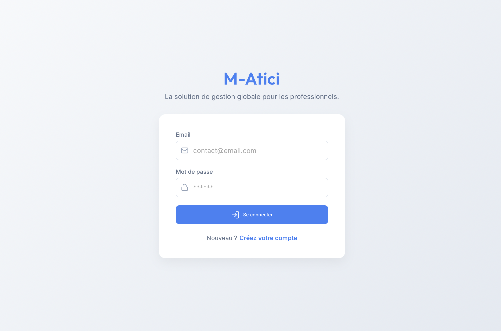
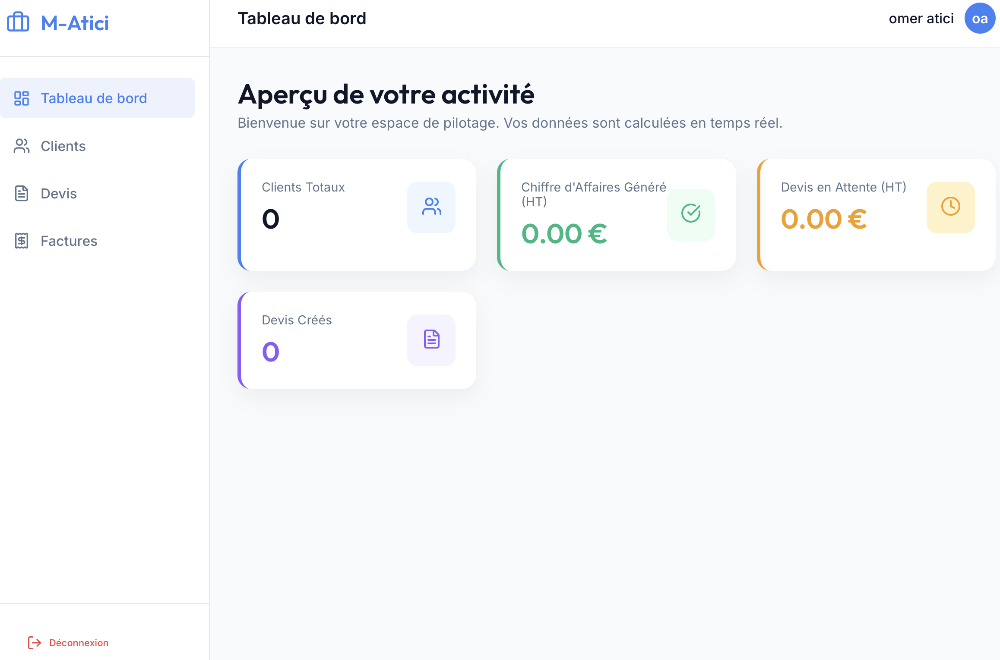
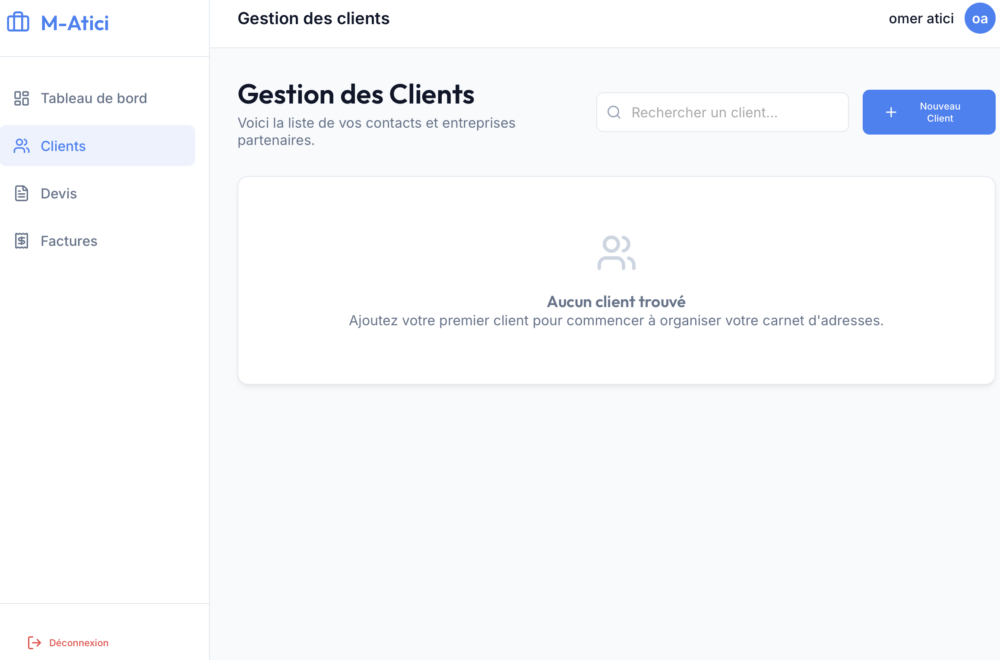
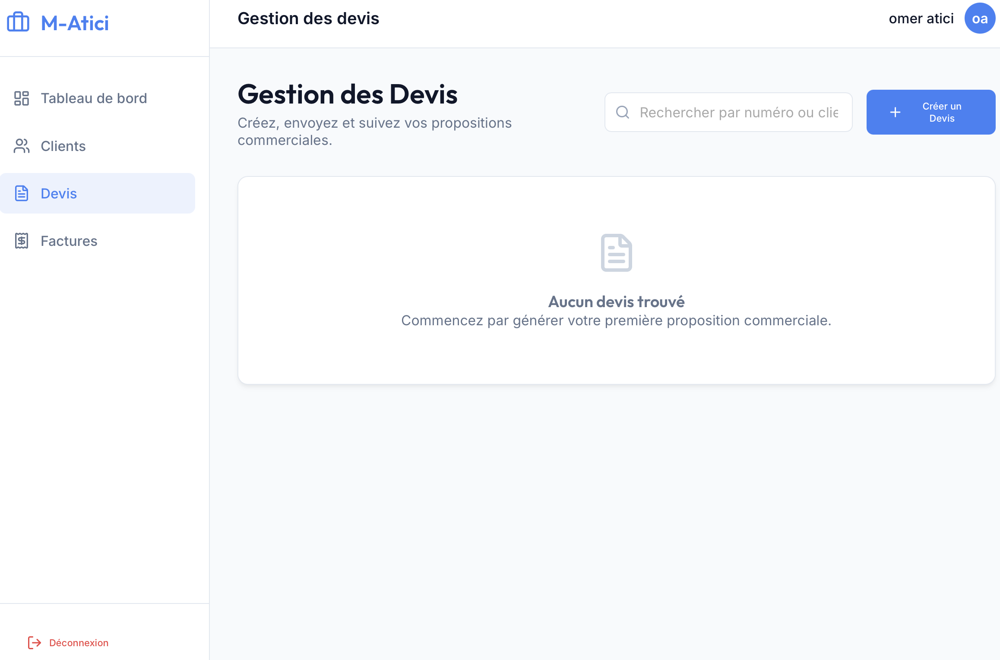
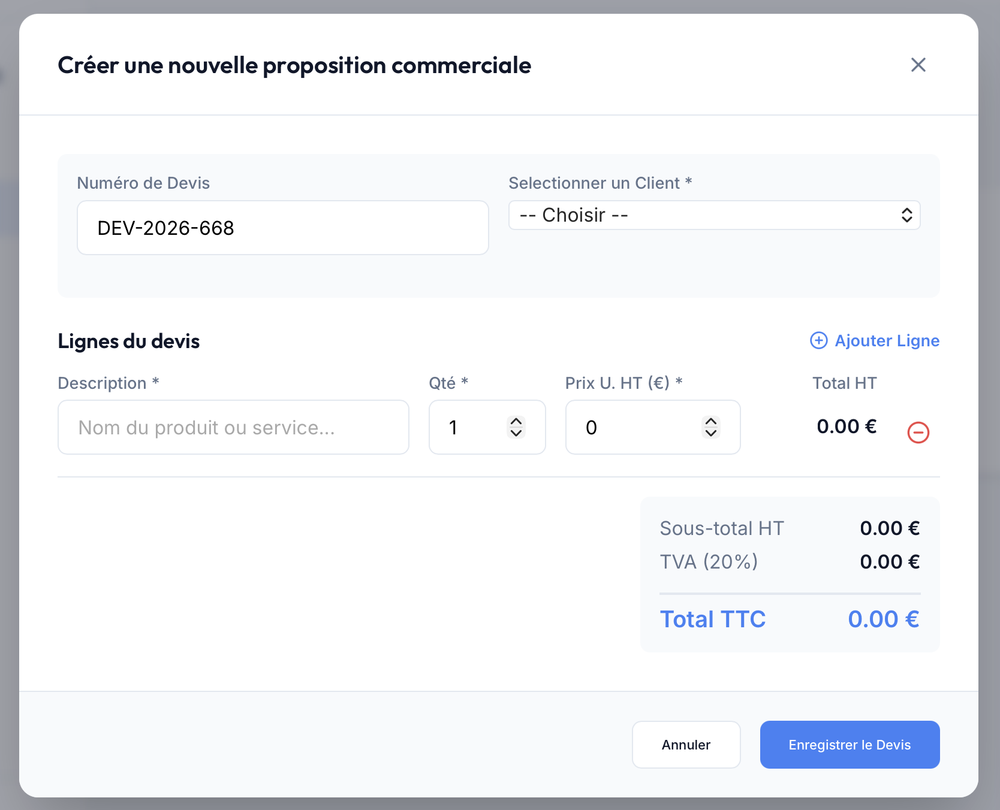
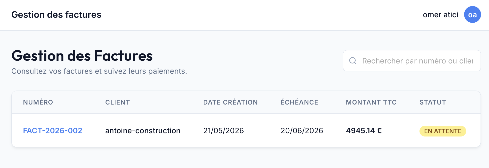
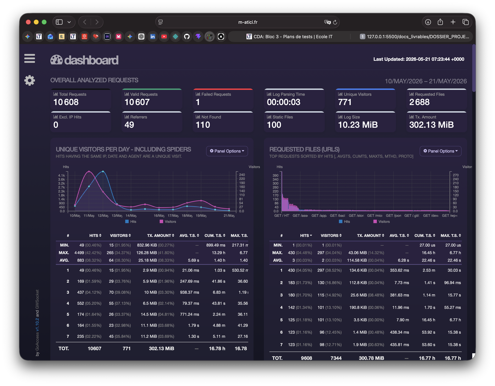

---
pdf_options:
  format: A4
  margin:
    top: 20mm
    bottom: 20mm
    left: 15mm
    right: 15mm
  printBackground: true
  displayHeaderFooter: true
  headerTemplate: "<div></div>"
  footerTemplate: "<div style='font-size: 10pt; width: 100%; text-align: center; font-family: sans-serif; color: #555;'><span class='pageNumber'></span></div>"
stylesheet: docs_livrables/dossier_style.css
---

# Dossier de Projet — Application Mini CRM SaaS

**Candidat :** Omer ATICI &nbsp;&nbsp;|&nbsp;&nbsp; **Certification :** Titre Professionnel CDA &nbsp;&nbsp;|&nbsp;&nbsp; **Année :** 2026

---

<div class="page-break"></div>

## Sommaire

<ul class="sommaire">
<li>I. Liste des compétences du référentiel</li>
<li>II. Résumé du projet et Cahier des charges</li>
<li>III. Gestion de projet</li>
<li>IV. Spécifications fonctionnelles, UX/UI et Captures de l'application</li>
<li>V. Modélisation et Base de données (UML et ORM)</li>
<li>VI. Architecture et Choix Techniques (Frontend & Backend)</li>
<li>VII. Réalisation et Sécurité (Détails du Code)</li>
<li>VIII. Qualité Logicielle (Tests Unitaires et CI/CD)</li>
<li>IX. Infrastructure et Déploiement Cloud (DevOps)</li>
<li>X. Présentation du jeu d'essai</li>
<li>XI. Description de la veille technologique</li>
<li>XII. Situation de travail ayant nécessité une recherche</li>
<li>XIII. Bilan et Perspectives</li>
</ul>

<div class="page-break"></div>

## I. Liste des compétences du référentiel

Ce projet de Mini CRM a été conçu pour valider les blocs de compétences du titre de Concepteur Développeur d'Applications (CDA) :

| Compétence visée (Référentiel CDA) | Implémentation dans le projet |
| :--- | :--- |
| **Maquetter une application** | Création du parcours utilisateur (Mobile-First). |
| **Développer une interface utilisateur** | Développement d'une SPA avec React.js et intégration responsive via Tailwind CSS. |
| **Concevoir une base de données** | Réalisation du MCD/MLD et élaboration du schéma relationnel sous PostgreSQL. |
| **Mettre en place une base de données** | Déploiement d'un conteneur Docker Postgres et application des migrations via Prisma. |
| **Développer des composants d'accès aux données** | Création d'une API REST Node.js/Express communicant avec la BDD via l'ORM Prisma. |
| **Élaborer des jeux d'essai** | Création de scripts de *seeding* automatisés pour générer de fausses données (clients, devis). |
| **Développer la partie back-end** | Implémentation des routes, de la logique métier (calcul TTC) et de la sécurité serveur. |
| **Déployer une application** | Mise en production sur un VPS Linux OVH, encapsulation Docker et proxy Caddy Server. |

<div class="page-break"></div>

## II. Résumé du projet et Cahier des charges

### 1. Contexte métier et problématique

La gestion administrative est souvent le point faible des artisans, freelances et très petites entreprises (TPE). La plupart de ces acteurs utilisent encore des solutions bureautiques inadaptées, chronophages et sources d'erreurs (fichiers Excel non centralisés, factures Word sans numérotation légale). L'objectif du projet est de fournir une solution logicielle sur-mesure, accessible en ligne (SaaS) : le **Mini CRM**.

### 2. La proposition de valeur

- **Simple et intuitive :** Le logiciel évite les usines à gaz comme Salesforce ou Odoo. On se concentre sur le cœur de métier administratif : Clients, Devis, et Factures.
- **Automatisée :** Transformation d'un devis en facture en un clic, génération automatique des documents PDF, et calcul des taxes instantané.
- **Cloud-based :** Accessible depuis n'importe quel appareil (ordinateur, tablette, smartphone) sans installation requise.

### 3. Persona utilisateur

**Julien, Artisan Plombier :** Il a besoin de gérer son carnet d'adresses et de faire des devis depuis sa tablette directement sur les chantiers. Il perd actuellement trop de temps le soir à rédiger ses factures avec des outils inadaptés. Il lui faut une application rapide qui génère des PDF conformes.

---

## III. Gestion de projet

Le développement a été piloté par une méthodologie **Agile (Kanban)**. La traçabilité des évolutions est assurée par un tableau de suivi découpé en colonnes (À faire, En cours, Test, Terminé). 

La gestion du code source s'appuie sur le versionnement **Git (GitHub)** avec des commits atomiques respectant la norme *Conventional Commits* (ex: `feat:`, `fix:`, `docs:`), permettant un travail incrémental et un historique de code lisible pour les révisions (Code Review) et l'intégration continue.

---

## IV. Spécifications fonctionnelles, UX/UI et Captures de l'application

Les fonctionnalités de l'application ont été développées en suivant les spécifications de User Stories précises.

### US-01 — Authentification
**Description :** Inscription et connexion sécurisée via email et mot de passe.
L'interface se veut claire et épurée pour encourager la conversion.



### US-02 — Tableau de bord (Dashboard)
**Description :** Une fois connecté, l'utilisateur a accès à une vue d'ensemble de son activité.



<div class="page-break"></div>

### US-03 — Gestion des Clients
**Description :** L'artisan peut ajouter, modifier et lister ses clients, avec une recherche rapide.



### US-04 — Création de Devis
**Description :** Création d'un devis en associant un client et en ajoutant des lignes de prestations. Les totaux HT, TVA et TTC se calculent automatiquement.




### US-05 — Conversion et Export PDF
**Description :** L'utilisateur peut convertir un devis accepté en facture officielle (ex: FACT-2026-001) et la télécharger au format PDF.



---

<div class="page-break"></div>

## V. Modélisation et Base de données (UML et ORM)

La persistance des données repose sur un SGBDR robuste : **PostgreSQL**.
Le projet intègre une architecture **Multi-tenant** : chaque ressource métier (Client, Devis, Facture) est fortement liée à l'Utilisateur l'ayant créée, garantissant un cloisonnement strict des données entre les différents artisans utilisant la plateforme SaaS.

### 1. Modèle Conceptuel des Données (MCD)


### 2. Diagramme de classes


### 3. Diagramme de Cas d'utilisation


<div class="page-break"></div>

### 4. Implémentation Physique : L'ORM Prisma

Au lieu d'écrire des requêtes SQL brutes ou d'utiliser un ORM obsolète, le projet utilise **Prisma**, un ORM nouvelle génération. Prisma génère un client typé dynamiquement, prévenant les erreurs lors de la compilation plutôt qu'à l'exécution.

Voici un extrait réel du fichier `schema.prisma` démontrant la gestion des relations et les contraintes de base de données :

```prisma
// Générateur du client Prisma
generator client {
  provider = "prisma-client-js"
}

// Table des devis
model Devis {
  id          Int      @id @default(autoincrement())
  numero      String   @unique
  statut      String   @default("brouillon") // brouillon, envoyé, accepté, refusé
  dateEmission DateTime @default(now())
  dateEcheance DateTime?
  totalHT     Float    @default(0)
  totalTTC    Float    @default(0)
  tva         Float    @default(20)

  // Relation vers l'utilisateur propriétaire
  userId   Int
  user     User   @relation(fields: [userId], references: [id])

  // Relation vers le client associé
  clientId Int
  client   Client @relation(fields: [clientId], references: [id])

  // Lignes du devis (Cascade delete)
  lignes LigneDevis[]
  
  // Relation optionnelle vers la facture générée
  facture Facture?
}
```

---

<div class="page-break"></div>

## VI. Architecture et Choix Techniques (Frontend & Backend)

L'application respecte une architecture **Client-Serveur** totalement découplée, favorisant la scalabilité et la maintenance.

### 1. Stack Technique Globale

| Couche | Technologie | Justification |
| :--- | :--- | :--- |
| **Backend API REST** | Node.js & Express.js | Performance I/O non-bloquante, cohérence JS full-stack. |
| **Base de Données** | PostgreSQL & Prisma | Robustesse transactionnelle, typage strict et auto-migration. |
| **Génération PDF** | Puppeteer | Moteur Chrome Headless côté serveur pour un rendu HTML vers PDF pixel-perfect. |
| **Frontend SPA** | React.js & Vite | Rendu dynamique côté client, Hot Module Replacement (HMR) ultra-rapide. |
| **Stylisation** | Tailwind CSS | Design system orienté utilitaire, permettant un rendu responsive (Mobile-first) très rapide sans CSS spaghetti. |
| **Réseau client** | Axios | Librairie HTTP fiable, intercepteurs permettant l'injection automatique du jeton de sécurité. |

<div class="page-break"></div>

### 2. Focus Architecture Frontend : React Router

Côté client, l'application est une Single Page Application (SPA). Le rechargement de page est évité grâce à l'utilisation de `react-router-dom`. Le routage inclut une logique de protection : un utilisateur non authentifié est automatiquement redirigé vers l'écran de connexion.

Extrait de `App.jsx` illustrant cette architecture de routage protégée :

```javascript
import { useState } from 'react';
import { BrowserRouter, Routes, Route, Navigate } from 'react-router-dom';
import Authentification from './pages/Authentification';
import Layout from './composants/Layout';
// ... autres imports

function App() {
  const [estConnecte, setEstConnecte] = useState(!!localStorage.getItem('crm_token'));

  // Protection d'accès : Si pas connecté, affiche le composant d'authentification
  if (!estConnecte) {
    return <Authentification onLoginSuccess={() => setEstConnecte(true)} />;
  }

  // Application protégée avec Système de Routage imbriqué
  return (
    <BrowserRouter>
      <Routes>
        {/* Le composant Layout encapsule toutes les pages sécurisées */}
        <Route path="/" element={<Layout onLogout={gererDeconnexion} />}>
          <Route index element={<Dashboard />} />
          <Route path="clients" element={<Clients />} />
          <Route path="devis" element={<Devis />} />
          <Route path="factures" element={<Factures />} />
          <Route path="*" element={<Navigate to="/" replace />} />
        </Route>
      </Routes>
    </BrowserRouter>
  );
}
```

---

<div class="page-break"></div>

## VII. Réalisation et Sécurité (Détails du Code)

La sécurité applicative est la priorité absolue d'une solution SaaS manipulant des données financières. 

### 1. Stratégie de Sécurité
- **Anti-XSS :** React échappe nativement les variables lors de la réconciliation du DOM virtuel.
- **Mots de passe :** Hashés avec `bcrypt` (ils n'apparaissent jamais en clair dans la BDD).
- **Anti-injection SQL :** Toutes les requêtes passent par l'ORM Prisma, qui génère des requêtes préparées (Prepared Statements).
- **Cloisonnement des données :** À chaque requête API, le serveur vérifie que la ressource ciblée appartient bien à l'utilisateur faisant la requête.

<div class="page-break"></div>

### 2. Implémentation du contrôle d'accès : JSON Web Token (JWT)

L'authentification ne se base pas sur des sessions stockées côté serveur (étatless), mais sur des **JSON Web Tokens (JWT)** signés cryptographiquement. À chaque appel API, le client envoie son token dans le header `Authorization`.

Voici l'extrait du middleware métier (`authentification.middleware.js`) développé pour intercepter et valider ces requêtes :

```javascript
const jwt = require('jsonwebtoken');

/**
 * Middleware d'authentification
 * Vérifie la présence et la validité du token JWT dans l'en-tête de la requête HTTP.
 */
module.exports = (req, res, next) => {
  try {
    const enTeteAutorisation = req.headers.authorization;
    
    if (!enTeteAutorisation) {
      return res.status(401).json({ message: "Requête non authentifiée. Token manquant." });
    }

    // Récupération du token après le mot clé "Bearer" (norme OAuth2)
    const token = enTeteAutorisation.split(' ')[1];
    
    // Vérification de l'intégrité du token via la clé secrète serveur
    const tokenDecode = jwt.verify(token, process.env.JWT_SECRET);
    
    // Transmission sécurisée de l'ID utilisateur aux routes (controllers) suivantes
    req.utilisateurId = tokenDecode.id;
    next(); // Autorisation accordée, on passe au controller métier
    
  } catch (erreur) {
    res.status(401).json({ message: "Token invalide ou expiré." });
  }
};
```

Grâce à ce composant, toute tentative d'accès à une route protégée sans token valide est bloquée instantanément avec un code HTTP 401 (Unauthorized).

---

<div class="page-break"></div>

## VIII. Qualité Logicielle (Tests Unitaires et CI/CD)

Pour garantir la fiabilité de la solution en production, des processus d'Assurance Qualité (QA) rigoureux ont été mis en place.

### 1. Stratégie de Tests Automatisés (Jest)

Le cœur métier de l'application a été isolé pour être testé via le framework **Jest**. Ces tests garantissent que les règles métier critiques (comme la facturation) sont exactes et résilientes face aux mises à jour futures.

Extrait de `calculDevis.test.js` qui valide les algorithmes financiers :

```javascript
const { calculerTotalDevis } = require('../utils/calculDevis');

describe('Calculs des devis', () => {
  it('doit calculer le total HT et TTC correctement pour une seule ligne', () => {
    const lignes = [{ quantite: 2, prixUnitaire: 50 }];
    const resultat = calculerTotalDevis(lignes);
    
    expect(resultat.totalHT).toBe(100);
    expect(resultat.totalTTC).toBe(120); // Test TVA par défaut à 20%
    expect(resultat.tva).toBe(20);
  });

  it('doit calculer le total HT et TTC correctement pour plusieurs lignes', () => {
    const lignes = [
      { quantite: 1, prixUnitaire: 100 },
      { quantite: 3, prixUnitaire: 20 }
    ];
    const resultat = calculerTotalDevis(lignes);
    
    expect(resultat.totalHT).toBe(160);
    expect(resultat.totalTTC).toBe(192); // Vérification de la somme matricielle
  });
});
```

<div class="page-break"></div>

### 2. Pipeline d'Intégration Continue (CI/CD GitHub Actions)

Le code n'est pas déployé à l'aveugle. Un pipeline automatisé s'exécute sur les serveurs de GitHub à chaque `push`. Si les tests échouent, le pipeline s'arrête, bloquant ainsi le déploiement d'une régression en production.

Extrait du workflow YAML (`main.yml`) :

```yaml
name: CI/CD Pipeline

on: [push]

jobs:
  verifier-code:
    runs-on: ubuntu-latest
    steps:
      - uses: actions/checkout@v3

      - name: Installer Node.js
        uses: actions/setup-node@v3
        with:
          node-version: 20

      - name: Test backend
        run: |
          cd backend
          npm install
          npx prisma generate
          npm test

  deploiement:
    needs: verifier-code
    runs-on: ubuntu-latest
    if: github.ref == 'refs/heads/main'
    # La suite du pipeline s'exécute uniquement si 'verifier-code' a réussi
```

<div class="page-break"></div>

## IX. Infrastructure et Déploiement Cloud (DevOps)

L'application n'est pas qu'un projet local, elle est intégralement déployée en environnement professionnel sur un serveur **VPS OVHcloud** accessible sous un domaine dédié (`m-atici.fr`).

### 1. Orchestration avec Docker

L'intégralité de l'écosystème est "conteneurisée". Ceci assure que l'application s'exécute de manière identique en développement, en phase de test et en production.

Extrait du fichier `docker-compose.yml` démontrant la liaison des microservices :

```yaml
services:
  # Base de données
  db:
    image: postgres:15
    environment:
      POSTGRES_DB: crm
      # ... variables secrètes d'environnement
    volumes:
      - db_data:/var/lib/postgresql/data

  # Backend API Node.js
  backend:
    build: ./backend
    environment:
      - DATABASE_URL=postgresql://user:password@db:5432/crm
    ports:
      - "3000:3000"
    depends_on:
      - db

  # Serveur Web Caddy (Reverse Proxy + Let's Encrypt SSL)
  caddy:
    image: caddy:2-alpine
    restart: unless-stopped
    ports:
      - "80:80"
      - "443:443"
    depends_on:
      - frontend
      - backend
```

<div class="page-break"></div>

### 2. Le Serveur Caddy et HTTPS

Caddy a été préféré à Nginx pour sa simplicité et sa capacité native à générer et renouveler automatiquement les certificats SSL via **Let's Encrypt**. Tout le trafic est chiffré en HTTPS, sécurisant ainsi l'échange des tokens JWT et des mots de passe.

### 3. Monitoring

Le conteneur **GoAccess** analyse les logs générés par le serveur web (Caddy) et restitue un tableau de bord visuel des statistiques de trafic réseau en temps réel, permettant de surveiller la santé du serveur.



### 4. Tâches planifiées (Cron) et Sauvegardes

Afin d'assurer la conformité RGPD et l'automatisation des relances, deux tâches planifiées récurrentes (`cron`) sont configurées sur le système hôte du VPS :
- **Relances de paiement automatiques (US4)** : Un script autonome (`backend/src/scripts/alerteRetard.js`) s'exécute chaque jour pour détecter les factures "en attente" dont l'échéance est dépassée, passer leur statut à "en retard" et envoyer un e-mail de rappel automatique au client via Nodemailer.
- **Sauvegarde automatisée de la base de données** : Un script shell (`scripts/backup-db.sh`) est lancé toutes les nuits pour exporter la base PostgreSQL (`pg_dump`) depuis le conteneur Docker. Le script compresse la sauvegarde et applique une politique de rétention de 7 jours (respect du droit à l'oubli).
 
---
 
<div class="page-break"></div>

## X. Présentation du jeu d'essai

Afin de pouvoir tester et présenter l'application aux correcteurs et clients potentiels sans partir d'une base vide, un script professionnel de "Seeding" a été développé (intégré nativement via la commande d'ORM `npx prisma db seed`).

Ce jeu d'essai manipule directement l'API Prisma pour injecter de fausses données relationnelles cohérentes :

1. Un compte administrateur racine (`admin@m-atici.fr`).
2. La création d'une dizaine de faux clients avec des noms d'entreprises réalistes.
3. La génération d'une vingtaine de devis à des stades cycliques différents (Brouillon, Envoyé, Accepté) associés à ces clients.
4. La création de factures finales pour les devis "acceptés".

Ce processus permet de valider empiriquement le bon fonctionnement des filtres de la base de données, des requêtes de jointure de l'API, des algorithmes de calcul des totaux sur le Dashboard, et de la pagination de l'interface graphique.

---

## XI. Description de la veille technologique

Le développement de ce projet a été alimenté par une veille technologique active, primordiale dans l'écosystème web en perpétuelle évolution.

1. **Sources d'informations (Outils) :** 
   - Utilisation quotidienne de Feedly (agrégateur de flux RSS) ciblant des blogs techniques comme Smashing Magazine ou le blog officiel de React.
   - Alertes algorithmiques Twitter/X et LinkedIn sur les mots-clés du stack (Node.js, Docker, Cybersecurity).
   - Inscription aux newsletters spécialisées (Node Weekly, Frontend Focus).

2. **Cibles de la veille (Sécurité) :**
   - Surveillance stricte des alertes CVE (Common Vulnerabilities and Exposures) touchant le monde open-source JavaScript.
   - Utilisation native de `npm audit` et des alertes *GitHub Dependabot* pour maintenir les dépendances à l'abri des failles zero-day.

3. **Mise en pratique au sein du projet :**
   - *Cas concret :* Suite à des lectures pointues sur les problématiques de performance des ORM traditionnels Node.js (tels que Sequelize ou TypeORM), et face à l'essor grandissant de TypeScript, le choix s'est porté sur **Prisma**. L'ORM offre un typage statique prédictif bien supérieur et des migrations de schémas plus sécurisées, qui ont grandement accéléré la conception de la base de données du Mini CRM.

---

## XII. Situation de travail ayant nécessité une recherche

**Problématique rencontrée :** La génération des factures PDF avec Puppeteer en environnement de production conteneurisé.

En phase de développement local (sur OS de bureau Mac/Windows), la génération de fichiers PDF à l'aide de Puppeteer (outil qui lance un navigateur Google Chrome invisible côté serveur pour faire le rendu de la facture) fonctionnait parfaitement. Cependant, lors du premier déploiement en production sur le serveur VPS OVH (qui tourne sous Linux encapsulé dans Docker), l'application Node.js crashait systématiquement au moment critique de générer une facture pour le client.

**Démarche de recherche et Résolution :**

1. **Diagnostic via les logs :** La commande `docker logs <container_id>` a mis en évidence une erreur fatale (`Failed to launch the browser process`). L'erreur indiquait un manque flagrant de bibliothèques systèmes dynamiques, normalement fournies par une interface graphique, mais absentes d'une image Docker Node minimaliste (Alpine/Debian Lite).
2. **Recherche documentaire :** Investigation des *issues* sur le GitHub officiel de Puppeteer, et lectures croisées sur *StackOverflow* concernant le couplage de Puppeteer et Docker.
3. **Mise en place de la solution :**
   - **Côté Dockerfile :** Refonte du processus de "Build" du conteneur Backend pour forcer l'installation de Chromium en ligne de commande ainsi que ses dépendances graphiques Linux nécessaires (`libnss3`, `libxss1`, `libasound2`...).
   - **Côté Code (Node.js) :** Modification des paramètres d'initialisation de l'instance Puppeteer pour lui injecter les arguments système `--no-sandbox` et `--disable-setuid-sandbox`. Ces drapeaux (flags) désactivent une fonctionnalité de bac-à-sable de Chrome qui entre en conflit direct avec le bac-à-sable natif de Docker, autorisant ainsi la génération de PDF en parfaite sécurité au sein du serveur VPS.

---

<div class="page-break"></div>

## XIII. Bilan et Perspectives

Le cycle de conception, développement et déploiement de ce Mini CRM SaaS m'a permis d'appliquer concrètement et avec succès l'ensemble du périmètre des compétences attendues d'un Concepteur Développeur d'Applications (CDA).

De l'étude de faisabilité UX jusqu'au monitoring réseau de l'infrastructure Docker hébergée, ce projet s'est mué en un logiciel *Minimum Viable Product* (MVP) professionnellement fonctionnel, sécurisé, et prêt à absorber de la charge.

**Perspectives d'évolution techniques et fonctionnelles (Roadmap) :**

1. **Planification d'interventions :** Implémentation d'un module d'agenda partagé pour les artisans afin de planifier les rendez-vous clients directement liés aux devis et factures.
2. **Fintech :** Intégration de l'API de paiement Stripe pour permettre aux clients des artisans de régler directement leurs factures en ligne par carte bancaire via un portail client dédié, réduisant ainsi drastiquement les délais de paiement.
3. **Data Visualisation :** Amélioration analytique de l'interface d'administration avec des graphiques de statistiques complexes (via Chart.js ou Recharts), permettant un suivi précis de l'évolution du Chiffre d'Affaires annuel en un coup d'œil.
