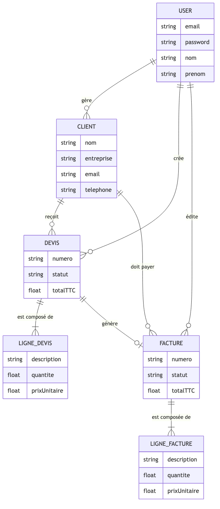
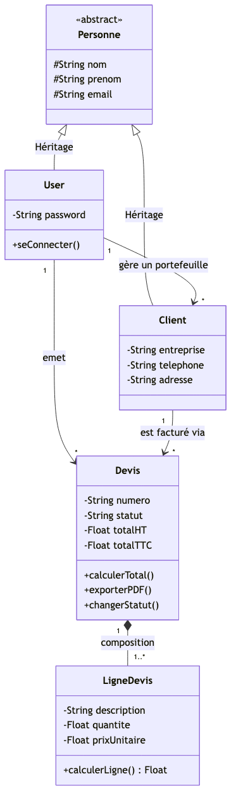

---
pdf_options:
  format: A4
  margin: 20mm 15mm
  printBackground: true
stylesheet: docs_livrables/dossier_style.css
---

# Dossier de Projet — Application Mini CRM SaaS

**Candidat :** Omer ATICI &nbsp;&nbsp;|&nbsp;&nbsp; **Certification :** Titre Professionnel CDA &nbsp;&nbsp;|&nbsp;&nbsp; **Année :** 2026

---

## Sommaire

<ul class="sommaire">
<li>I. Liste des compétences du référentiel</li>
<li>II. Résumé du projet et Cahier des charges</li>
<li>III. Gestion de projet</li>
<li>IV. Spécifications fonctionnelles et UX/UI</li>
<li>V. Modélisation et Base de données (UML)</li>
<li>VI. Architecture et Choix Techniques</li>
<li>VII. Réalisation et Sécurité</li>
<li>VIII. Qualité Logicielle (Tests et CI/CD)</li>
<li>IX. Infrastructure et Déploiement Cloud</li>
<li>X. Présentation du jeu d'essai</li>
<li>XI. Description de la veille technologique</li>
<li>XII. Situation de travail ayant nécessité une recherche</li>
<li>XIII. Bilan et Perspectives</li>
</ul>

## I. Liste des compétences du référentiel

Ce projet de Mini CRM a été conçu pour valider les blocs de compétences du titre CDA :

| Compétence visée (Référentiel CDA) | Implémentation dans le projet |
| :--- | :--- |
| **Maquetter une application** | Création du parcours utilisateur (Mobile-First). |
| **Développer une interface utilisateur** | Développement SPA en React.js et Tailwind CSS. |
| **Concevoir une base de données** | Réalisation du MCD/MLD et implémentation PostgreSQL. |
| **Mettre en place une base de données** | Déploiement d'un conteneur Postgres et migrations Prisma. |
| **Développer des composants d'accès aux données** | API REST Node.js/Express communicant avec l'ORM Prisma. |
| **Élaborer des jeux d'essai** | Création de scripts de *seeding* pour générer de fausses données. |
| **Développer la partie back-end** | Routes, logique métier (calcul TTC) et sécurité serveur. |
| **Déployer une application** | Mise en production sur VPS OVH via Docker et Caddy Server. |

---

## II. Résumé du projet et Cahier des charges

### 1. Contexte métier et problématique

La gestion administrative est souvent le point faible des artisans, freelances et très petites entreprises (TPE). La plupart de ces acteurs utilisent encore des solutions bureautiques inadaptées (Excel, Word). L'objectif est de fournir une solution logicielle sur-mesure, accessible en ligne (SaaS) : le **Mini CRM**.

### 2. La proposition de valeur

- **Simple et intuitive :** On se concentre sur le cœur de métier (Clients, Devis, Factures).
- **Automatisée :** Transformation d'un devis en facture en un clic, génération de PDF, calcul des taxes instantané.

### 3. Persona utilisateur

**Julien, Artisan Plombier :** Il a besoin de gérer son carnet d'adresses et de faire des devis depuis sa tablette sur les chantiers. Il perd trop de temps le soir à faire ses factures avec des outils trop complexes et inadaptés.

---

## III. Gestion de projet

Le développement a été piloté par une méthodologie **Agile (Kanban)**. La traçabilité des évolutions est assurée par un tableau de suivi découpé en colonnes (À faire, En cours, Test, Terminé). La gestion du code source s'appuie sur **Git (GitHub)** avec des commits atomiques respectant la norme *Conventional Commits* (ex: `feat:`, `fix:`, `docs:`), permettant un travail incrémental et un historique lisible.

---

## IV. Spécifications fonctionnelles et UX/UI

| User Story | Description |
| :--- | :--- |
| **US-01 — Authentification** | Inscription et connexion sécurisée via email/mot de passe. |
| **US-02 — Clients** | Ajouter, modifier et lister ses clients. |
| **US-03 — Devis** | Créer un devis, associer un client, ajouter des lignes avec calcul automatique. |
| **US-04 — Facturation** | Convertir un devis accepté en facture officielle (ex: FACT-2026-001). |
| **US-05 — Export PDF** | Générer et télécharger la facture au format PDF. |

**Charte graphique :** Design *Mobile-First*, thème clair, couleurs axées sur la productivité (bleu professionnel), typographie Inter.

## V. Modélisation et Base de données (UML)

La persistance des données repose sur un SGBDR PostgreSQL. Chaque ressource (Client, Devis, Facture) est liée à l'Utilisateur l'ayant créée, garantissant un cloisonnement total des données (Multi-tenant).

### 1. Modèle Conceptuel des Données (MCD)

### 2. Diagramme de classes

### 3. Diagramme de Cas d'utilisation

## VI. Architecture et Choix Techniques

L'application respecte une architecture **Client-Serveur** découplée.

| Couche | Technologie | Justification |
| :--- | :--- | :--- |
| **Backend API REST** | Node.js & Express.js | Performance I/O, cohérence JS full-stack. |
| **ORM** | Prisma | Sécurité typée, protection injections SQL, migrations auto. |
| **Génération PDF** | Puppeteer | Chrome Headless côté serveur, rendu HTML fidèle. |
| **Frontend SPA** | React.js & Vite | HMR rapide, composants réutilisables. |
| **Stylisation** | Tailwind CSS | Design system utilitaire, responsive natif. |
| **Réseau client** | Axios | Intercepteurs pour injection automatique du JWT. |

## VII. Réalisation et Sécurité

La sécurité des données est au centre des développements :

| Mécanisme | Description |
| :--- | :--- |
| **JWT (Auth)** | Token signé généré au login, vérifié par middleware à chaque requête. |
| **Cloisonnement** | L'API vérifie que l'utilisateur est propriétaire de la ressource demandée. |
| **Anti-XSS** | React échappe nativement les variables lors du rendu du DOM virtuel. |
| **Mots de passe** | Hashés avec `bcrypt`, jamais stockés en clair. |
| **Anti-injection SQL** | Toutes les requêtes passent par Prisma (requêtes préparées). |

---

## VIII. Qualité Logicielle (Tests et CI/CD)

### 1. Stratégie de Tests (Jest)

Le cœur métier est couvert par des tests unitaires (**Jest**) :
- Tests d'authentification : hashage du mot de passe, gestion des erreurs, génération du token.
- Tests métiers (`calculDevis.test.js`) : vérification stricte des algorithmes de calcul financier (HT, TVA, TTC).

### 2. Intégration Continue (GitHub Actions)

Un pipeline CI automatisé (`main.yml`) est déclenché à chaque Push sur GitHub. Il installe Node.js et exécute la suite de tests Jest pour empêcher tout déploiement de code régressif en production.

---

## IX. Infrastructure et Déploiement Cloud

Déploiement DevOps professionnel sur un VPS **OVHcloud** sous le nom de domaine `m-atici.fr`.

| Service | Rôle |
| :--- | :--- |
| **Docker Compose** | Orchestration multi-conteneurs (PostgreSQL, Redis, Backend, Frontend). |
| **Caddy Server** | Reverse-proxy + génération automatique des certificats SSL/HTTPS (Let's Encrypt). |
| **GoAccess** | Analyse des logs Caddy, tableau de bord de trafic en temps réel. |
| **Script Shell** | `deploy-staging.sh` automatise le pull git, le rebuild Docker et les migrations Prisma. |

## X. Présentation du jeu d'essai

Afin de pouvoir tester et présenter l'application sans partir d'une base vide, un script de "Seeding" a été développé (via `npx prisma db seed`). Ce jeu d'essai injecte :

1. Un compte utilisateur par défaut (`admin@m-atici.fr`).
2. Une dizaine de faux clients avec des noms d'entreprises réalistes.
3. Une vingtaine de devis à des stades différents (Brouillon, Envoyé, Accepté) et des factures associées.

Cela permet de valider le bon fonctionnement des filtres, des algorithmes de calcul et de la pagination de l'interface.

---

## XI. Description de la veille technologique

L'écosystème JavaScript évoluant très vite, une veille technologique régulière est mise en place.

| Axe | Détail |
| :--- | :--- |
| **Outils** | Feedly (RSS), Twitter/X (mots-clés du stack), newsletters Node Weekly & React Status. |
| **Sécurité** | Alertes CVE, `npm audit`, GitHub Dependabot pour les dépendances vulnérables. |
| **Frameworks** | Suivi des évolutions (ex: migration Webpack → Vite.js pour les performances de build). |
| **Mise en pratique** | Remplacement de Sequelize par **Prisma** pour son typage statique et ses migrations sécurisées. |

---

## XII. Situation de travail ayant nécessité une recherche

**Problématique rencontrée :** La génération des factures PDF avec Puppeteer en production.

En développement local (Mac/Windows), la génération fonctionnait parfaitement. Lors du déploiement sur le VPS OVH (Linux/Docker), l'application crashait systématiquement.

**Démarche de résolution :**

1. **Analyse des logs Docker :** L'erreur indiquait un manque de bibliothèques systèmes requises par Chromium.
2. **Recherche documentaire :** Consultation de *StackOverflow* et de la documentation officielle *Puppeteer/Docker*.
3. **Solution :** Modification du `Dockerfile` pour installer les dépendances Linux manquantes (`libnss3`, `libxss1`, `libasound2`...) et exécution de Puppeteer avec le flag `--no-sandbox`, obligatoire en environnement conteneurisé.

## XIII. Bilan et Perspectives

Le développement de ce Mini CRM SaaS m'a permis d'appliquer concrètement l'ensemble des compétences de conception, de développement et d'infrastructure d'un Concepteur Développeur d'Applications.

**Perspectives d'évolution :**
- Système de relance client automatique par email (Nodemailer + Tâche Cron).
- Intégration de l'API de paiement Stripe pour le règlement direct des factures.
- Graphiques de statistiques sur le tableau de bord (via Chart.js).
