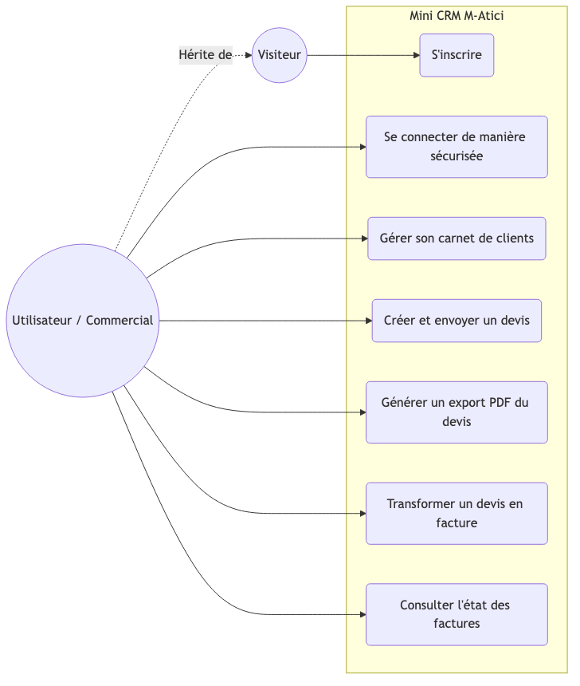

# Livrable de Gestion de Projet CDA

- **Projet :** Mini CRM (Clients & Devis)
- **Méthodologie :** KANBAN
- **Étudiant :** Omer Atici
- **Date du livrable :** 02 Avril 2026

## 1. Choix de la méthodologie (KANBAN)
Pour ce projet de développement seul, j'ai choisi la méthodologie **KANBAN** pour les raisons suivantes :
- **Flux Continu :** Kanban permet de travailler sur les tâches sans la contrainte des Sprints fixes, ce qui est idéal pour s'adapter à la vitesse d'avancement réelle du projet.
- **Visualisation du travail :** L'utilisation des colonnes (À faire, En cours, Test, Fini) offre une vision claire et immédiate de l'état du projet à tout moment.
- **Optimisation du WIP (Work In Progress) :** J'évite de commencer trop de tâches en même temps, ce qui réduit le temps de cycle pour chaque fonctionnalité (ex: finir l'Authentification avant d'ouvrir le chantier Devis).
- **Flexibilité :** Si une fonctionnalité urgente est demandée (ex: correctif de sécurité), elle peut être intégrée immédiatement en haut de la colonne "À faire" sans attendre un cycle planifié.

## 2. Diagramme de Cas d'Utilisation

*Interaction des différents acteurs avec le système du Mini CRM.*

## 3. Backlog Produit (User Stories)
- **US-01 - Authentification :** En tant qu'utilisateur, je veux pouvoir m'inscrire et me connecter de manière sécurisée pour accéder à mon tableau de bord personnel.
- **US-02 - Gestion des Clients :** En tant qu'utilisateur, je veux pouvoir lister, ajouter et modifier les informations de mes clients pour centraliser mon carnet d'adresses.
- **US-03 - Création de Devis :** En tant qu'utilisateur, je veux pouvoir créer des devis détaillés avec des lignes de produits et un calcul automatique des montants HT et TTC.
- **US-04 - Exportation PDF :** En tant qu'utilisateur, je veux transformer numériquement mes devis au format PDF pour pouvoir les envoyer par email de manière professionnelle.
- **US-05 - Tableau de Bord :** En tant qu'administrateur, je veux visualiser des statistiques sur les ventes et l'état des devis afin de suivre l'évolution de mon entreprise.
