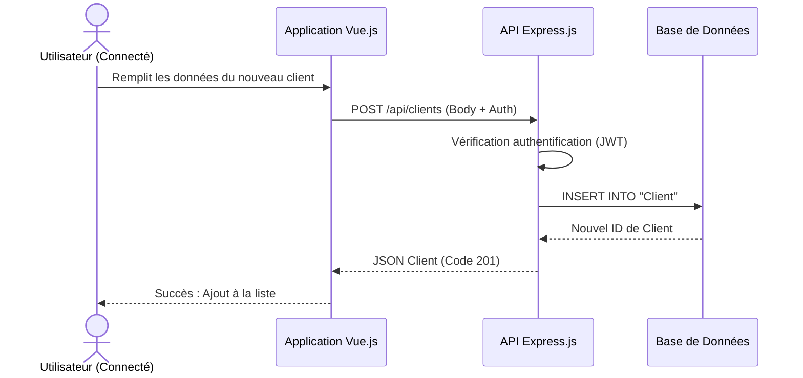
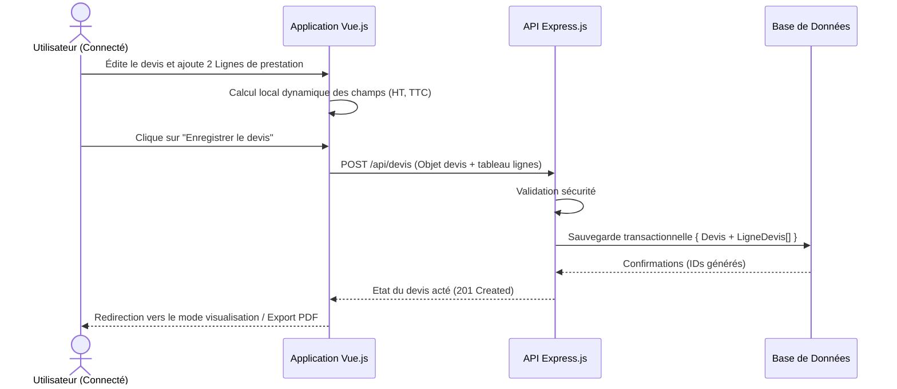

# Conception et Modélisation - Mini CRM

Ce document présente la conception technique complète de l'application Mini CRM, basée sur une architecture fullstack JavaScript (Vue.js, Express.js) et une base de données relationnelle (PostgreSQL gérée via l'ORM Prisma).

---

## 1. Dictionnaire de données

Le dictionnaire regroupe toutes les données stockées et manipulées au sein de l'application, réparties par entités principales.

### Entité `User` (Comptes utilisateurs / Commerciaux)
| Nom du champ | Type | Description | Contrainte |
| :--- | :--- | :--- | :--- |
| `email` | AN | Adresse email de connexion | UNIQUE, Obligatoire |
| `password` | AN | Mot de passe hashé (bcrypt) | Obligatoire |
| `nom` | A | Nom de famille | Obligatoire |
| `prenom` | A | Prénom | Obligatoire |
| `dateCreation` | D | Date de création du compte | Automatique |

### Entité `Client`
| Nom du champ | Type | Description | Contrainte |
| :--- | :--- | :--- | :--- |
| `nom` | A | Nom du contact | Obligatoire |
| `prenom` | A | Prénom du contact | Obligatoire |
| `email` | AN | Email du client | Optionnel |
| `telephone` | AN | Numéro de téléphone | Optionnel |
| `entreprise` | AN | Nom de l'entreprise | Optionnel |
| `adresse` | AN | Adresse postale complète | Optionnel |
| `dateCreation` | D | Date de création | Automatique |

### Entité `Devis`
| Nom du champ | Type | Description | Contrainte |
| :--- | :--- | :--- | :--- |
| `numero` | AN | Numéro du devis (ex: DEV-2026-001) | UNIQUE, Obligatoire |
| `statut` | A | Statut (brouillon, envoyé, accepté, refusé) | Défaut 'brouillon' |
| `dateEmission` | D | Date de création/émission | Automatique |
| `dateEcheance` | D | Date d'échéance / validité | Optionnel |
| `totalHT` | N | Somme totale Hors Taxes | Calculé |
| `totalTTC` | N | Somme totale Toutes Taxes Comprises | Calculé |
| `tva` | N | Taux de TVA (Pourcentage) | Défaut 20 |
| `notes` | AN | Conditions ou notes spécifiques | Optionnel |

### Entité `LigneDevis` (Détail des prestations)
| Nom du champ | Type | Description | Contrainte |
| :--- | :--- | :--- | :--- |
| `description`| AN | Nom de la prestation/produit | Obligatoire |
| `quantite` | N | Nombre d'unités | Obligatoire |
| `prixUnitaire` | N | Prix de l'unité HT | Obligatoire |
| `total` | N | Total pour cette ligne (quantite * prix) | Calculé |

---

## 2. Modèles de base de données : MCD / MLD / MPD

### Modèle Conceptuel des Données (MCD)

Règles de gestion :
* Un `User` gère plusieurs `Client` et crée plusieurs `Devis`.
* Un `Client` est géré par un seul `User` et peut recevoir plusieurs `Devis`.
* Un `Devis` appartient à un seul `Client`, est créé par un seul `User` et continent plusieurs `LigneDevis`.

### Modèle Logique des Données (MLD)
*   **User** (<ins>id</ins>, email, password, nom, prenom, createdAt)
*   **Client** (<ins>id</ins>, nom, prenom, email, telephone, entreprise, adresse, createdAt, updatedAt, *userId*)
*   **Devis** (<ins>id</ins>, numero, statut, dateEmission, dateEcheance, totalHT, totalTTC, tva, notes, createdAt, updatedAt, *userId*, *clientId*)
*   **LigneDevis** (<ins>id</ins>, description, quantite, prixUnitaire, total, *devisId*)

### Modèle Physique des Données (MPD)
Généré par Prisma PostgreSQL.
*SGBD Cible : PostgreSQL*

#### Table `User`
| Colonne | Type PostgreSQL | Clé | Contraintes |
| :--- | :--- | :--- | :--- |
| `id` | SERIAL | **PK** | NOT NULL |
| `email` | VARCHAR(255) | | UNIQUE, NOT NULL |
| `password` | VARCHAR(255) | | NOT NULL |
| `nom` | VARCHAR(255) | | NOT NULL |
| `prenom` | VARCHAR(255) | | NOT NULL |
| `createdAt` | TIMESTAMP | | DEFAULT CURRENT_TIMESTAMP |

#### Table `Client`
| Colonne | Type PostgreSQL | Clé | Contraintes |
| :--- | :--- | :--- | :--- |
| `id` | SERIAL | **PK** | NOT NULL |
| `nom` | VARCHAR(255) | | NOT NULL |
| `prenom` | VARCHAR(255) | | NOT NULL |
| `email` | VARCHAR(255) | | |
| `telephone` | VARCHAR(255) | | |
| `entreprise` | VARCHAR(255) | | |
| `adresse` | VARCHAR(255) | | |
| `userId` | INTEGER | **FK** | REFERENCES "User"("id") |
| `createdAt` | TIMESTAMP | | DEFAULT CURRENT_TIMESTAMP |
| `updatedAt` | TIMESTAMP | | NOT NULL |

#### Table `Devis`
| Colonne | Type PostgreSQL | Clé | Contraintes |
| :--- | :--- | :--- | :--- |
| `id` | SERIAL | **PK** | NOT NULL |
| `numero` | VARCHAR(255) | | UNIQUE, NOT NULL |
| `statut` | VARCHAR(255) | | DEFAULT 'brouillon' |
| `dateEmission` | TIMESTAMP | | DEFAULT CURRENT_TIMESTAMP |
| `dateEcheance` | TIMESTAMP | | |
| `totalHT` | DOUBLE PRECISION | | DEFAULT 0 |
| `totalTTC` | DOUBLE PRECISION | | DEFAULT 0 |
| `tva` | DOUBLE PRECISION | | DEFAULT 20 |
| `notes` | TEXT | | |
| `userId` | INTEGER | **FK** | REFERENCES "User"("id") |
| `clientId` | INTEGER | **FK** | REFERENCES "Client"("id") |
| `createdAt` | TIMESTAMP | | DEFAULT CURRENT_TIMESTAMP |
| `updatedAt` | TIMESTAMP | | NOT NULL |

#### Table `LigneDevis`
| Colonne | Type PostgreSQL | Clé | Contraintes |
| :--- | :--- | :--- | :--- |
| `id` | SERIAL | **PK** | NOT NULL |
| `description`| VARCHAR(255) | | NOT NULL |
| `quantite` | DOUBLE PRECISION | | NOT NULL |
| `prixUnitaire` | DOUBLE PRECISION | | NOT NULL |
| `total` | DOUBLE PRECISION | | NOT NULL |
| `devisId` | INTEGER | **FK** | REFERENCES "Devis"("id") ON DELETE CASCADE |

---

## 3. Diagramme de classes (Architectures serveur / Modèles)

---

## 4. Diagrammes de Séquence

L'application comportant plusieurs parcours majeurs, voici les deux séquences principales : la gestion des acteurs (Clients) et la création financière (Devis).

### Séquence 1 : Création d'un Client

### Séquence 2 : Création d'un Devis (Fonctionnalité Financière)

