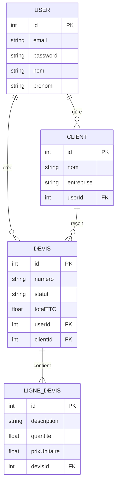
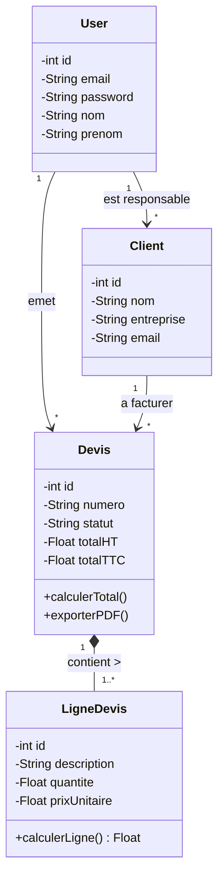
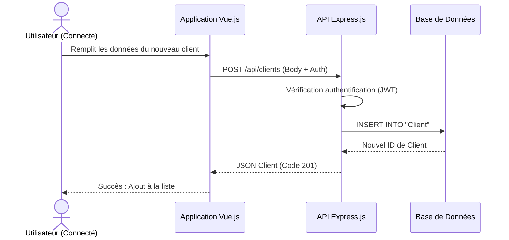
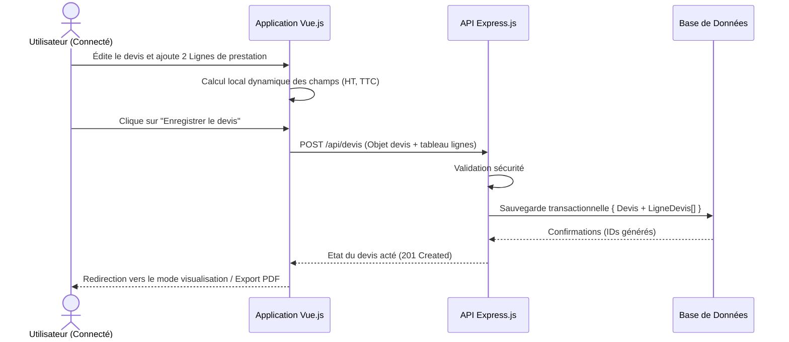

# Conception et Modélisation - Mini CRM

Ce document présente la conception technique complète de l'application Mini CRM, basée sur une architecture fullstack JavaScript (Vue.js, Express.js) et une base de données relationnelle (PostgreSQL gérée via l'ORM Prisma).

---

## 1. Dictionnaire de données

Le dictionnaire regroupe toutes les données stockées et manipulées au sein de l'application, réparties par entités principales.

### Entité `User` (Comptes utilisateurs / Commerciaux)
| Nom du champ | Type | Description | Contrainte |
| :--- | :--- | :--- | :--- |
| `id` | INT | Identifiant unique de l'utilisateur | PK, Auto-incrément |
| `email` | VARCHAR(255) | Adresse email de connexion | UNIQUE, NOT NULL |
| `password` | VARCHAR(255) | Mot de passe hashé (bcrypt) | NOT NULL |
| `nom` | VARCHAR(255) | Nom de famille | NOT NULL |
| `prenom` | VARCHAR(255) | Prénom | NOT NULL |
| `createdAt` | TIMESTAMP | Date de création du compte | DEFAULT CURRENT_TIMESTAMP |

### Entité `Client`
| Nom du champ | Type | Description | Contrainte |
| :--- | :--- | :--- | :--- |
| `id` | INT | Identifiant unique du client | PK, Auto-incrément |
| `nom` | VARCHAR(255) | Nom du contact | NOT NULL |
| `prenom` | VARCHAR(255) | Prénom du contact | NOT NULL |
| `email` | VARCHAR(255) | Email du client | Optionnel |
| `telephone` | VARCHAR(255) | Numéro de téléphone | Optionnel |
| `entreprise` | VARCHAR(255) | Nom de l'entreprise | Optionnel |
| `adresse` | VARCHAR(255) | Adresse postale complète | Optionnel |
| `userId` | INT | Utilisateur (Commercial) responsable du client | FK vers `User(id)` |
| `createdAt` | TIMESTAMP | Date de création | DEFAULT CURRENT_TIMESTAMP |
| `updatedAt` | TIMESTAMP | Date de mise à jour | Auto-géré |

### Entité `Devis`
| Nom du champ | Type | Description | Contrainte |
| :--- | :--- | :--- | :--- |
| `id` | INT | Identifiant unique du devis | PK, Auto-incrément |
| `numero` | VARCHAR(255) | Numéro du devis (ex: DEV-2026-001) | UNIQUE, NOT NULL |
| `statut` | VARCHAR(50) | Statut (brouillon, envoyé, accepté, refusé) | DEFAULT 'brouillon' |
| `dateEmission` | TIMESTAMP | Date de création/émission | DEFAULT CURRENT_TIMESTAMP |
| `dateEcheance` | TIMESTAMP | Date d'échéance / validité | Optionnel |
| `totalHT` | FLOAT(53) | Somme totale Hors Taxes | DEFAULT 0 |
| `totalTTC` | FLOAT(53) | Somme totale Toutes Taxes Comprises | DEFAULT 0 |
| `tva` | FLOAT(53) | Taux de TVA (Pourcentage) | DEFAULT 20 |
| `notes` | TEXT | Conditions ou notes spécifiques | Optionnel |
| `userId` | INT | Utilisateur créateur du devis | FK vers `User(id)` |
| `clientId` | INT | Client à qui est rattaché le devis | FK vers `Client(id)` |

### Entité `LigneDevis` (Détail des prestations)
| Nom du champ | Type | Description | Contrainte |
| :--- | :--- | :--- | :--- |
| `id` | INT | Identifiant de la ligne | PK, Auto-incrément |
| `description`| VARCHAR(255) | Nom de la prestation/produit | NOT NULL |
| `quantite` | FLOAT(53) | Nombre d'unités | NOT NULL |
| `prixUnitaire` | FLOAT(53) | Prix de l'unité HT | NOT NULL |
| `total` | FLOAT(53) | Total pour cette ligne (quantite * prix) | NOT NULL |
| `devisId` | INT | Devis parent auquel appartient la ligne | FK vers `Devis(id)` |

---

## 2. Modèles de base de données : MCD / MLD / MPD

### Modèle Conceptuel des Données (MCD)

Règles de gestion :
* Un `User` gère plusieurs `Client` et crée plusieurs `Devis`.
* Un `Client` est géré par un seul `User` et peut recevoir plusieurs `Devis`.
* Un `Devis` appartient à un seul `Client`, est créé par un seul `User` et continent plusieurs `LigneDevis`.



### Modèle Logique des Données (MLD)
*   **User** (<ins>id</ins>, email, password, nom, prenom, createdAt)
*   **Client** (<ins>id</ins>, nom, prenom, email, telephone, entreprise, adresse, createdAt, updatedAt, *userId*)
*   **Devis** (<ins>id</ins>, numero, statut, dateEmission, dateEcheance, totalHT, totalTTC, tva, notes, createdAt, updatedAt, *userId*, *clientId*)
*   **LigneDevis** (<ins>id</ins>, description, quantite, prixUnitaire, total, *devisId*)

### Modèle Physique des Données (MPD)
Généré par Prisma PostgreSQL.
```sql
CREATE TABLE "User" (
    "id" SERIAL PRIMARY KEY,
    "email" VARCHAR(255) UNIQUE NOT NULL,
    "password" VARCHAR(255) NOT NULL,
    "nom" VARCHAR(255) NOT NULL,
    "prenom" VARCHAR(255) NOT NULL,
    "createdAt" TIMESTAMP NOT NULL DEFAULT CURRENT_TIMESTAMP
);

CREATE TABLE "Client" (
    "id" SERIAL PRIMARY KEY,
    "nom" VARCHAR(255) NOT NULL,
    "prenom" VARCHAR(255) NOT NULL,
    "email" VARCHAR(255),
    "telephone" VARCHAR(255),
    "entreprise" VARCHAR(255),
    "adresse" VARCHAR(255),
    "createdAt" TIMESTAMP NOT NULL DEFAULT CURRENT_TIMESTAMP,
    "updatedAt" TIMESTAMP NOT NULL,
    "userId" INTEGER NOT NULL REFERENCES "User"("id")
);

CREATE TABLE "Devis" (
    "id" SERIAL PRIMARY KEY,
    "numero" VARCHAR(255) UNIQUE NOT NULL,
    "statut" VARCHAR(255) NOT NULL DEFAULT 'brouillon',
    "dateEmission" TIMESTAMP NOT NULL DEFAULT CURRENT_TIMESTAMP,
    "dateEcheance" TIMESTAMP,
    "totalHT" DOUBLE PRECISION NOT NULL DEFAULT 0,
    "totalTTC" DOUBLE PRECISION NOT NULL DEFAULT 0,
    "tva" DOUBLE PRECISION NOT NULL DEFAULT 20,
    "notes" TEXT,
    "createdAt" TIMESTAMP NOT NULL DEFAULT CURRENT_TIMESTAMP,
    "updatedAt" TIMESTAMP NOT NULL,
    "userId" INTEGER NOT NULL REFERENCES "User"("id"),
    "clientId" INTEGER NOT NULL REFERENCES "Client"("id")
);

CREATE TABLE "LigneDevis" (
    "id" SERIAL PRIMARY KEY,
    "description" VARCHAR(255) NOT NULL,
    "quantite" DOUBLE PRECISION NOT NULL,
    "prixUnitaire" DOUBLE PRECISION NOT NULL,
    "total" DOUBLE PRECISION NOT NULL,
    "devisId" INTEGER NOT NULL REFERENCES "Devis"("id") ON DELETE CASCADE
);
```

---

## 3. Diagramme de classes (Architectures serveur / Modèles)



---

## 4. Diagrammes de Séquence

L'application comportant plusieurs parcours majeurs, voici les deux séquences principales : la gestion des acteurs (Clients) et la création financière (Devis).

### Séquence 1 : Création d'un Client


### Séquence 2 : Création d'un Devis (Fonctionnalité Financière)

